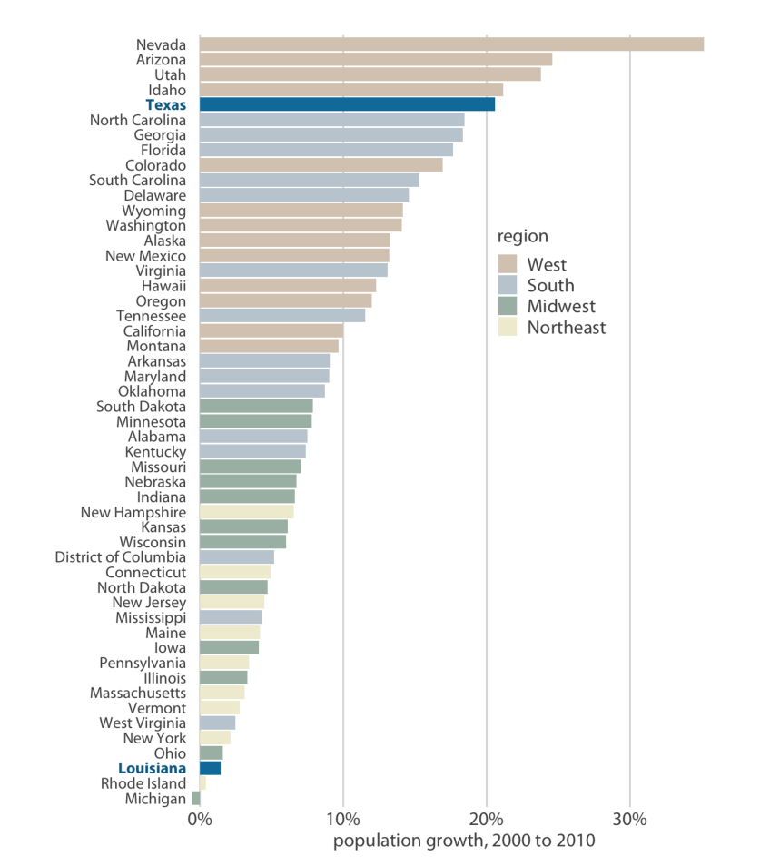

# 前言

数据可视化的作用：利用人类视觉系统的特点，直观地传达信息。

## 图表绘制原则

* 简单优于复杂；

* 不要喧宾夺主：所有视觉元素都要为传达的主题服务；

* 除非必要，不创造新的图表类型；

* 强调故事性；

示例1：机场航班延误数据

这张图想表达什么？

示例2：有故事的图表

论文预印本网站 arXiv 上，生物领域每月论文发表数量：

为什么在预印论文发表量大幅增加的背景下，作为影响力最大网站2014年却出现了拐点？

## 构建工具链

打造高效的数据可视化工具链：

* 持续改进；

* 多复用，少重复：内容与展示分离，见下面示例；

* 自动化；

示例3：如何避免重复

Facebook 2013 ~ 2017 年间的股票价格：

传递的信息：发展速度很快，且比其他科技巨头速度更快：

为什么 Excel 不宜作为数据分析场景中的图表生成工具？

Excel 是一种交互式图表生成工具，与自动图表生成工具（例如 R/Python/Matlab 脚本）相比，
交互式图表生成工具由于需要手工参与图表生成，具有如下缺点：

* 一张图表即使大部分环节自动生成，仅手工做后期完善，也会丧失**可复现性** (reproducible)，
  使同事/客户/利益相关方无法完整复现，或者验证其正确性；

* 手工处理图表消耗制作者的时间和精力，使制作者没有条件或者不愿意在数据变化后及时更新图表；

* 手工处理的步骤容易出错，或者随着时间推移被遗忘，
  根据新数据制作的图表难以保持与之前版本在表达效果上的一致性。

* 无法实现版本管理。

## 内容概览

第一部分：如何根据信息类型选择图类型；

第二部分：如何在选定的图上确定各个元素，例如颜色、大小等；

第三部分：其他问题，例如绘图软件的选择等。

# Part I: 从数据到图表

## 将数据映射到特征

绘图过程，就是将数据转换为图的某个数值特征的过程，
首先列出常见的数据及其特点：

| 数据类型      | 示例          | 类别     |
| ------------- |--------------| ----------|
| 连续型数值量  | 1.3, 5.7, 83 | 连续      |
| 离散型数值量  | 1, 2, 3, 4   | 离散      |
| 无序类型量    | 猫、狗、花   | 离散      |
| 有序类型量    | 好、中、差   | 离散      |
| 日期和时间    | 2019.12.1    | 连续/离散 |
| 文本          | 数据可视化   | 离散      |

接下来看常见图形特征（*aesthetics*）：
（哪些是连续的，哪些是离散的？）

这些特征**通常**分为两类：

* 用来表示连续量的，例如：位置（坐标）、大小、颜色、线宽等；

* 用来表示离散量的，例如：形状、线类型（如实线、虚线...）等；

最后，如何将数据映射（*scales*）到图形特征上呢？

下面的例子展示了如何将一组离散量映射到3种不同的特征上，

下面是一个实际的例子，4座城市的月度气温变化数据，
下图包含了几种数据，分别是什么类型，又是如何映射到特征上的？

<!-- x：有序离散；y：连续数值；颜色：无序离散 -->

下面这张图又是如何映射的？

<!-- x：有序离散；y：无序离散；颜色：连续数值 -->

以上是3个映射的例子，能不能在一张图上包含更多的映射呢？
下面看一个包含了5个映射的例子：

讨论：5个映射分别将哪些量映射为哪些特征？

总结：映射原则：一对一映射，避免产生歧义。

## 坐标系和轴

坐标系（*coordinate system*）的定义：
一组（常见是两个）位置映射以及它们彼此间的位置关系，
例如笛卡尔坐标系的两个映射，x, y 坐标轴是彼此垂直的：

坐标系按照坐标轴是否线性，分为两类：
线性轴和非线性轴，在线性笛卡儿坐标中，图形在线性变换后形状不变：

### 非线性坐标轴

非线性变换既可以处理数据，也可以处理坐标轴，
当变换数据时，要反映在坐标轴标题上，当变换坐标轴时，要反映在坐标轴刻度上：

下面研究一下对数坐标轴，它适合用于展示比例数据（为什么）。

下图是 Texas 州各县人口在线性坐标轴中呈现的效果：

下图是对数坐标系中的效果：

上图中，1（即$10^0$）处于轴中心，正负 magnitude 对称分布在这条线两侧。

当目标数据包含多个 magnitude（比如 3 的 mag 是 1，23 的 mag 是2，0.3 的是 -1 等）时，
对数坐标效果优于线性坐标。

对数轴的缺点是无法表示0值 ($\log(0) = -\infty$，在负无穷远处)，
如果需要表示0值，可以使用平方根轴，但它的缺点是不像对数轴的刻度有明确的含义
（一个刻度表示magnitude变化一级）。
但在表示平方量（比如面积）时，平方根轴效果比较好：

下图对比了美国州面积在线性轴(a)和平方根轴(b)下的柱图：

平方根轴给出的对比效果更好。

### 曲线坐标轴

下图对比了直角坐标系和极坐标系中同一份数据的展示效果：

极坐标适于展示周期性数据，例如前面4个不同地点的年温度变化的例子，
下图使用极坐标系，年末与年初闭合在一起，比 <a href="#fig2_3">图 2.3</a> 使用的直角坐标系更直观：

另一个适合使用曲线坐标系的场景是地图，下图对比了直角坐标和几种曲线坐标下的世界地图：

直角坐标系下两极部分的变形严重，曲线坐标的效果比较好。

## 颜色映射 

颜色有三种功能：

* 区分不同组数据；

* 展示数据值；

* 强调某些数值；

这三种场景下使用颜色的方法区别很大。

### 颜色作为分组工具

用于分组的颜色叫做**类别颜色映射** (qualitative color scale)，
这种场景下的一组颜色中的各个颜色应该彼此差别明显和均匀，且不能给人留下有顺序的感觉：

使用颜色作为分组工具：

通过颜色可以明显看出西部和南部州的人口增长明显高于中西部和东北部。

### 颜色代表数据值

代表数值的颜色叫做**顺序颜色映射** (sequential color scale)，
这样的颜色组可以基于单一色调，也可以包含多个色调：

在地图上使用顺序颜色尤其有用：

如果需要展示两组数据的数值，例如正数和负数，应使用**相对颜色映射** (diverging color scale)，
相当于是有一个共同点的两组顺序颜色映射的组合：

例如用相对颜色映射展示的德州各县白人比例的变化：

### 颜色作为强调工具

用于强调的色彩组合叫做**强调颜色映射** (accent color scale)：

使用时要注意**基底颜色** (baseline color) 应采用淡色，
确保读者注意力完全集中到**强调颜色** (accent color) 上，
没有述及如何将要突出的分组分配给 accent color.

使用强调颜色映射展示相邻的两个南部州人口增长率相差却很大：

当使用强调颜色时，为了淡化非强调颜色，避免与强调颜色争夺读者注意力，
最简单的方法是丢掉非强调数据原有的颜色信息，统一处理为淡灰色：

## 图形总览

下面对各类图表做一个整体概括。

### 数量

当需要展示一组类别量的某个数值特征时（例如各省人口平均预期寿命），
常用**柱图** (bar plot) 或者**点图** (dot plot) 表示：

如果要展示一组类别量的多个数值特征时，
可使用**堆叠柱图** (stacked bars) 或者**分组柱图** (grouped bars)，
例如各省人口的平均预期寿命和身高。
如果需要展示两组类别量的同一数值特征时，例如不同省份和性别的平均预期寿命，
可以使用 heatmap，分别将类别量映射到 x, y 轴上，数值量映射到颜色上：

见[6. 展示数量]。

### 分布

当需要展示包含多个类别的总体中，各类别的数量，即**分布**时，
常用直方图 (histogram) 和 密度图 (density plot)（见 [7. 展示分布]）：

直方图和密度图存在参数选择问题，不同的参数最终效果差别很大，
累积分布图和Q-Q图能忠实地反应数据的特征，但直观性比较差
（见 [8. 展示分布：经验累计分布函数和 Q-Q 图]）：

同时展示多个类别各自的分布情况，使用箱线图 (box plot)、提琴图 (violin plot)、
带状图 (strip chart), Sina plot，堆叠直方图、堆叠密度图、脊线图等：
（见 [9. 展示多个分布]）：

### 比例

展示多种成分彼此间的比例关系，常用饼图 (pie chart)、相邻柱图 (side-by-side bars)、
堆叠柱图 (stacked bars)：

见 [10. 展示比例]。

同时表示多个类别的比例关系，可以用多饼图 (multiple pie charts)、
分组柱图 (grouped bars)、堆叠柱图 (stacked bars)、堆叠密度图 (stacked densities)：

当比例关系由多组类别量定义，可以使用马赛克图 (mosaic plot)、
树图 (treemap)、parallel set 等：

见 [11. 展示多层比例]。

### x-y 关系

最简单的两个数值 (quantitative) 量使用散点图 (scatterplot) 表示，
详见 [12. 展示两个或多个数值量之间的关系]，
如果有第3个数值量，则演变为 bubble chart。
如果 x, y 单位相同，使用成对散点图 (paired scatterplot) 或斜坡图 (slopegraph)：

如果数据点的数量非常大，可以使用 density contours, 2D bins, hex bins 等图，
见[18. 处理重叠点]。如果要展示多个向量之间的相关系数，可以使用 correlograms：

当 x 轴为时间或者其他严格递增的量（如用药量）时，通常使用折线图 (line graph)，
见[13. 展示时间序列及其他独立变量的函数]，
展示一个时间序列上的两个响应变量，应使用连接散点图 (connected scatterplot)，
展示大数据集上的整体趋势，应使用光滑折线图 (smooth line graph)：

见[14. 展示趋势]。

### 地理位置数据

地理信息相关的数据使用下面几种图展示：

详见[15. 展示地理数据]。

### 不确定性

表示随机变量可能存在的范围，可以用误差带图 (error bars) 表示，
可以水平或者竖直伸展，或者包含两个方向（同时展示两个误差范围），
或者采用多级误差带图 (graded error bars)：

当需要展示误差更详细的情况，不仅有范围，还有分布时，
可以使用置信条图 (confidence strips)、眼睛图 (eyes)、半眼图 (hal-eyes)
或者分位数点图 (quantile dot plot)：

将误差带图中的随机点扩展到线，就得到了置信带图 (confidence band)、
多级置信带图 (graded confidence band) 和拟合图 (fitted draws)：

详见[16. 展示不确定性]。

## 展示数量

使用场景：展示多个分类中，每一类的一个**数量**值。
例如不同国家人的平均身高。

### 单组数量展示：柱图

柱图 (bar plots) 的类型如果比较多，且类型名称比较长，横放空间不够，
可以将 vertical bar 改为 horizontal bar plot.

当类型之间没有关系时，一般按数值大小排列；
当类型之间有关系时，要按类型顺序排列，见图 6-5 和 6-6 的对比。

### 多组数量展示：Grouped and stacked Bars

例如在收入数据集中，按年龄段和种族两个维度分组，再计算每个组的平均收入。

Grouped bars 取多个分组维度中的一个作为 x 轴，另一个用不同颜色区别，
但取哪个做 x 轴，哪个用颜色分组，会产生不同的认知效果（见图 6-7 和 6-8）。

另一种更直观的方式是将不同的分组放在不同的 bar plot 中，
避免了区别颜色的负担（图 6-9）。

当展示目标是数量时，可以使用 stacked bar plot（图 6-10），
但这个场景实际上更适合用下一章的分布图处理，
且 stacked bar 和 stacked histogram 没有本质区别，
只是 stacked bar 没有 y 轴，数量值标记在 bar 上，
stacked histogram 则用 y 轴表示数量。

### 点图与热力图

柱图使用 bar 的长度表示值的大小，在某些情况下会不方便，
例如一组分布在 $[60, 85]$ 之间的数，用柱图表示区别不大。

为了突出区别，可以使用点图 (dot plot)，由于它使用坐标值而非长度表示数值大小，
因此可以其他突出数据中差异的左右，对比图 6-11 和 6-12。

为了使点图可以清晰地反映最大/最小值信息，应对点按顺序排序，
否则最大/最小值会被淹没在其他值中。

当分组中的组别很多，使用 grouped bar plot 会导致图很乱，有用的信息被淹没。
解决方法是使用颜色 [而非长度 (bar) 或者坐标值 (dot plot)] 表示数值大小，
这样的图叫做热力图 (heatmap).

热力图中，通过不同的组别排序标准，能够传达出不同的信息，
例如图 6-14 主要强调了 2016 年各国因特网的普及程度，
而图 6-15 主要强调了因特网在这些国家初期发展（普及率达到 20%）的时间早晚。

## 展示分布

分布的含义：数据集中一个变量的各个阶段的个数（或比例）。
例如：Titanic 数据集中，乘客年龄的分布（不同年龄段的乘客各有多少），
这里的 变量 是 年龄。

分布 与前一章 数量 的区别在于：前者的 y 值表示的是观测的个数（或比例），
后者的 y 值表示通过某种汇总方法（例如 sum, mean, median 等）计算得出的数值型量。

### 展示单个分布

直方图 (histogram) 是通过对数据做 binning 得到的，这里的关键因素是 bin 的宽度，
太小导致过多细节淹没整体趋势，太大则会丢失部分有用的特征，
需要通过不断尝试找到合理的 bin 的宽度，对比见图 7-2。

Histogram 从18世纪开始流行，近年来随着计算能力的增加，
density plot 开始取代 histogram，图 7-2 对应的 density plot 见图 7-3。

密度图 (density plot) 的两个关键参数是 kernel 和 bandwidth。
基于 Gaussian kernel 的 plot 比较平滑，而基于 rectangular kernel 则倾向于出现阶跃点。
bandwidth 对图的影响与 histogram 的 bin width 类似。

总体来说，观测数量越大，kernel 对最终图表的影响越小，
所以 density plot 适合展示大数据集，histogram 适合展示小数据集。

Density plot 一般要保证图形面积为1，这导致它的 y 轴数值不够直观，
例如年龄分布图中 y 轴 (density) 的范围大致在 $[0, 0.04]$ 范围内，
这是由于 x 轴（年龄）范围为 $[0, 75]$，
这表明 density plot 只展示 x 变量在各个区间内相对分布的多寡，
其 y 值没有实际含义。
比较而言，histogram 的 y 轴（属于对应 x 值范围内的观测个数，count）是有具体含义的。

使用 density plot 需要注意可能将 x 轴延伸到错误的范围内，
例如年龄分布图中出现了年龄为负的情况（见图 7-5）。

当需要在一张图上展示多个分布时，density plot 比 histogram 效果好。

### 展示多个分布

使用 histogram 图示多个分布时，可使用 stacked 和 overlapping 两种风格，
前者不同组之间的色柱不重叠（从下至上依次排列，图 7-6），
后者不同组之间的色柱重叠（都从0开始，图 7-7），
但二者很容易互相混淆，另外 stacked histogram 中， 位于上层的类别很难互相比较（图 7-6）。
Overlapping histogram 存在重叠区颜色易造成误解的问题。

所以 histogram 不适合展示多个分布。

比较好的解决方案是使用 density plot，并且分开放置（图 7-9）优于重叠放置（图 7-8）。

当展示数据只包含两个分组时，pyramid （图 7-10）是不错的方案。

图 7-11：用 density overlapping plot 展示多类别分布的正确方式。

## 展示分布：经验累计分布函数和 Q-Q 图

需要展示分布时，上一章的直方图和密度图虽然比较直观，
但受人为选择的参数（例如 bin width 和 bandwidth）的影响很大，
所以这两种图只能算是对数据的某种阐释 (interpretaion)，而不是对数据的直接展示。

将所有数据点描绘出来是个办法，但数据量大时，数据的多少并不能直接呈现出来。
所以统计学家发明了经验累计分布函数 (ECDF) 和 Q-Q 图实现无参数的完整数据展示，
它们的缺点是不够直观，很少出现在统计学领域之外的文章中。

### 经验累计分布函数

ECDF 类似于累计概率分布，但此书直接使用排名生成 ECDF，效果与累积概率分布类似。

学生成绩排名生成的图 8-3 可以用于寻找最合理的成绩划分边界，是比较新颖的一种用法，
作者对"合理"（以及反映它的横线长度）的定义也很有新意。

### 高度扭曲的分布

对于有长尾现象的分布（例如州人口分布，大部分人口集中分布在最发达的几个县），
要将长尾中包含的信息展示出来，可以将数据做对数变换，示例见图 8-5。

### Q-Q 图

Q-Q图 (quantile-quantile plot) 展示了实际数据与服从某种分布（一般是正态分布）的理论结果的相互关系。

根据 [68-95-99.7 rule](https://en.wikipedia.org/wiki/68%E2%80%9395%E2%80%9399.7_rule)，
$\mu + \sigma$ 处为 $50% + 34.1% = 84.1%$，$\mu + 2\sigma$ 处为 $50% + 34.1% + 13.6% = 97.7%$，
此处 $\mu = 10$，$\sigma = 3$，所以 50% 处为平均值10，84.1%（文中为 84%）处为 $10 + 3 = 13$，
97.7% （文中为 2.3rd percentile）处为 $10 - 2 \times 3 = 4$。

以文中所述50个学生成绩数据集为例，绘制图 8-8 的步骤是：

1. 计算出学生成绩的平均值 $\mu_0$ 和 方差 $\sigma_0$；

1. 生成一个容量为50，均值为 $\mu_0$，方差 $\sigma_0$ 的向量 $X$；

1. 对学生数据集排序，得到向量 $Y$；

1. 依次绘制50个数据点，第 $i$ 个点的坐标是 $[x_i, y_i]$。

## 展示多个分布

应用场景：
在一张图中展示多个月份的气温分布，每条曲线代表一个月份内的气温分布。

关键概念：

* 分组变量：用来将特征分成多个组，每组包含一个分布的 categorical feature，例如上面场景中的 月份；

* 响应变量：要展示的分布对应的量，例如上面场景中的 温度。

分组变量和响应变量各使用一个坐标轴，下面分别介绍响应变量在纵轴和横轴上的绘制方法。

### 沿纵轴展示

SE (standard error, 标准误) vs SD (standard deviation, 标准差):
前者指均值本身的精确度（因为均值是根据抽样而非总体计算出来的），
后者指数据在均值两侧的分散程度。

使用 中心加误差带 方式（图 9-1）展示分布存在的问题：

* 只能展示一个分布的中心和分散程度，丢失了其他信息；

* 难以确定中心代表的是均值还是中位数；

* 误差带表示的是 SD 还是 SE？要知道 SD 和 SE 的大小可没有一致关系；

* 误差带是对称分布的，往往不符合数据的实际情况。

Boxplot 解决了上述问题。

Violin plot 是 boxplot 的升级版，是第7章数据密度图旋转90度，再对称复制而成，
所以越宽的地方数据越多（见图 9-4）。

Violin plot 不适合展示数据分布特别不均匀的数据，因为这样会导致稠密部分的数据宽度太大。
另外由于 violin plot 需要保持形状的连续性，即使没有或者很少有数据的地方也有宽度，
因此不适合整体或者部分数据比较稀疏的场景。

这种场景中适合 strip chart，图 9-6, 9-7 给出了好和不好的两个示例。

将 violin plot 和 strip chart 组合起来，从而集二者之长，就得到了 sina plot，
见图 9-8。

### 沿横轴展示

第7章中，我们使用 histogram 和 density plot 沿 x 轴展示变量分布情况，
y 轴展示密度值。如果将 y 轴变成时间或者某个类型量，就得到了 ridgeline plot，
它能够同时展示多个分布，特别适合展示分布随时间变化的情况。

由于 ridgeline plot 的 y 轴和 violin plot 的 x 轴被用来表示分类变量，
没有地方标记密度大小刻度，所以它们适合展示和比较分布密度在特征和不同类型间的变化，
而不适合精确地展示分布的细节。

理论上可以用 histogram 代替 density plot 绘制 ridgeline plot，但由于遮盖效果的差异，
基于 histogram 的 ridgeline 很容易造成误解（见图 9-10），不推荐使用。

Ridgeline plot 可以同时展示大量分布，
图 9-11 展示了 1920 ~ 2000 年每年出品的电影长度的分布情况，
可以清楚地看到早期电影的长度更多样，但从 1960 年代开始，
大多数电影长度都控制在90分钟左右。

另一个适合使用 ridgeline 的场景是比较两个趋势随时间变化的情况，
图 9-12 展示了1963 ～ 2013 年间，美国众议院两党议员每次投票模式的分布情况。
可以清晰地看到两极化趋势随着时间推移不断加深。

## 展示比例

### 饼图实例

饼图 (pie chart) 适合突出一个或少数几个主要成分，且在数据量少时仍然有较好的表现。

Pie charts, stacked bars, side-by-side bars 各自的优缺点见表 10-1。

### Side-by-side bars 实例

当几个成分的比例比较接近时，饼图（图 10-4）和 stacked bars（图 10-5）既不能
直观表达各个成分的比例，同一时间序列的多个图也无法表示各成分变化的趋势。
这类场景中并列柱图 (side-by-side bars) 效果最好，见图 10-6。

### Stacked bars 实例

Stacked bars 由于多种成分连在一起，很难比较每个成分的变化情况，
但也有例外。

首先，当只有两种成分时：在比较两种成分的比例随时间变化的趋势时，
stacked bars 效果很好，见图 10-7。

其次，当分布的特征是连续变量，且分类数不太多时，
例如图 10-8，特征是年龄，四个类别也不太多，stacked density plot
比较好的反映了健康随年龄不断恶化的趋势。

### 比例组图

Side-by-side bars 不能直观地展示部分与整体的关系，
stacked bars 不能直观地展示同一个成分在不同类别中的变化趋势，
比例组图解决了上面两个问题，图 10-9 使用了与图 10-8 相同的数据，
但清晰展示了每种健康状况随年龄变化的趋势，以及它们分别在整体中所占的比例。

比例组图表达各健康状况相对比例随年龄变化不如 stacked bars 直观，
但也能看出来。
例如健康状态为良好 (good) 的曲线与总体曲线形状基本一致，
表明健康状况良好的人在总样本中的比例基本是稳定的；
而健康状况为一般 (fair) 的曲线形状与总体曲线形状明显不同：
总体样本在40～80这个年龄区间内下降明显，但 fair 的样本数反而缓慢上升，
说明 fair 在这个区间内比例明显上升。

如果认为这样还是不够直观，可以使用图 10-12 这样的方式，
把样本个数换成相对比例数，也就是将图 10-10 拆成4个图分别展示。

Side-by-side, stacked bars 由于使用相同的高度，
给人感觉是不同特征下样本量是一样的，
当需要向用户传达“样本数量随特征变化的变化趋势”时，
比例组图能够很好的表达这一信息。

## 展示多层比例

### 马赛克图 和 Treemap

马赛克图 (mosaic plot) 的使用场景：展示两个类别型变量在整个数据集中的分布情况。

使用马赛克图需要满足以下条件：

* 两个变量是不相关的，例如图 11-3 中，桥梁的建造年份和建造材料是不相关的，
  即建造年份相同的桥梁可以采用不同的材料，相同材料建造的桥梁也可以建于不同的年份。

* 每个变量都需要覆盖整个数据集，例如图11-3 中，
  变量 *建造年份* 只有 *crafts* 和 *modern* 是不行的，
  必须添加 *emerging* 和 *mature* 覆盖整个数据集；

与马赛克图的 tiling 风格不同，treemap 将整个绘图区域先按一个类型变量分割，
再在每个区域内部分别按第二个类型变量分割，结果是不同类型变量的值
（例如图 11-4 中的 *steel* 和 *modern*）会重叠放置，
且第二层变量（这里是 建造时间）的取值（例如 *mature*）会在整个图的多个地方出现。

Treemap 与马赛克图的区别：

* 不受两个类型变量的限制，但超过两个类型变量会使整个图变得混乱，
  难以传递有效的信息；

* 不要求类型变量彼此正交，例如图 11-5，类型变量 *地区* 和 *州*
  是从属关系，不是正交的。

* 主要强调最上层变量各个成分间的比例关系，例如图 11-4 强调了桥梁不同材质间的比例关系，
  马赛克图强调两个类型变量的各种组合下的子类型，
  （例如建造年代为 *mature* 且材料为 *steel* 的所有桥梁）之间的比例关系。

马赛克图和 stacked bars（例如图 10-5）的区别在于：
后者用 x 轴展示类型变量，并且是等宽度的，用 y 轴表示数值变量；
前者的 x 和 y 轴都用来表示类型变量，并且宽度和高度都与符合要求的观测数成正比，
结果是马赛克图中，每一块的面积大小直接反映了对应拥有这两个标签的观测数
（例如建造年代为 *mature* 且材料为 *steel* 的所有桥梁）占总观测数的比例。

马赛克图使用面积表示比例在有些情况下不够直观，例如图 11-3 中，
*emerging* 和 *mature* 两个时代的铁桥数量都是3，
但对应的图块形状完全不同，不容易比较大小。

解决方法是：在每个图块上标注数字（该组合对应的观测的数量），以方便读者验证。

### 嵌套饼图

马赛克图和 treemap 都采用面积表示比例，且都是用笛卡尔坐标。
如果我们仍然保持面积表示比例不变，但改为极坐标，就得到了嵌套饼图 (nested pies).

嵌套饼图有两种风格：
双层饼图（见图 11-6）和细分饼图（见图 11-7）。

双层饼图比较好地表达了两个变量内各个成分间的比例关系，
缺点是图上所有数字加起来是实际观测数的2倍（内圈数字和等于真实观测数，外圈数字和也等于观测数），
容易造成误解。

细分饼图与马赛克图相比，能够比较直观地反映各个成分间的大小关系，
但空间使用率低，导致代表小成分的扇形过于狭窄，视觉效果不好。

### 平行集图

需要展示的类型变量大于2时，马赛克、Treemap 和 嵌套饼图都不合适，
这时可以考虑使用平行集图 (parallel sets plot)。

提高平行集图可读性的建议（对比图 11-9 和 11-10）：

* 条带的颜色与最左侧的分类方法一致（因为我们习惯于从左向右阅读）；

* 尽量减少条带间的交叉。

## 展示两个或多个数值量之间的关系

### 散点图

最基本的散点图使用 x 和 y 轴分别表示一个数值量，见图 12-1。
如果要添加第3个数值量，可以使用气泡图，见图 12-3。

气泡图的缺点：

* 使用两种不同类型的方法（坐标轴位置和气泡半径大小）表示数值量，
  不容易让读者建立起“二者间关系”的印象；

* 使用气泡半径表示数值量大小不够直观，由于无法把气泡画得太大，
  即使最大和最小的气泡之间的差距也不明显，
  距离比较接近的值基本看不出半径的差别；

为了避免气泡图的缺点，可以使用一对一散点图矩阵 (all-against-all scatterplot matrix)，
每个子图展示两个数值量（或者加上一个类别型量，见图 12-4）之间的关系。

多元函数的可视化也遵循上述原则，只是多元函数中的 *自变量* 在数据分析中名字变成了 *特征*。
例如，要图形化二元函数 $z = f(x, y)$，
如果采用气泡图展示，可以先对自变量 $x$ 和 $y$ 做等间隔采样，将函数变为 data frame，
然后将 $x$ 值标记在 x 轴上，$y$ 控制气泡半径，$z$ 标记在 y 轴上。

如果采用一对一散点图矩阵展示，则是一个类似于图 12-4 的 $3 \times 3$ 矩阵。

最后还可以用 3D 图展示，但构造二维曲面成本比较高，
且如果不能旋转，可读性也并不好。
另外 3D 图无法展示多于2个自变量的函数。

### 相关系数图

当需要展示的数值量个数超过4个时，散点图矩阵中的子图会变得很小，
不再是合理的展示方法，这时应该使用相关系数图 (correlogram)。

基本的相关系数图见图 12-6，为了突出强相关，可以将相关系数的绝对值映射到
对应点的半径上，见图 12-7。

相关系数图虽然能够准确反应多个数值量之间的关系，
但完全不展示原始数据的形态，比较抽象。

### 数据降维

为了兼顾数据模式和原始数据展示，可以借助于降维技术。

数据降维分为两部分：

* 原始特征与 PC 的关系图（图 12-9）；

* 原始数据点在 PC 空间里的位置（图 12-10）；

结合图 12-9 和 12-10 说明图 PCA 图的方法：

图 12-9 表明镁元素 (Mg) 构成了 *PC1* 的正成分，
钡、钠、铝元素构成了 *PC1* 的负成分，
从图 12-10 可知窗玻璃样本 (window) 的数值点聚集在 $PC1 \gt 0$ 一侧，
而车头灯样本 (headlamp) 的数值点聚集在 $PC1 \lt 0$ 一侧，
综合二者可知，窗玻璃样本中的镁元素含量高于平均值，钡、钠、铝元素低于平均值，
而车头灯样本情况相反，镁元素含量低于平均值，钡、钠、铝元素高于平均值，

### 展示成组数据

成组数据中的一组数据来自于同一个对象在不同条件下得到的两个或多个测量数据，
例如一个人的左右臂长度，一个国家在2000年和2010年的人均碳排放量，一对双胞胎的身高等。

成组数据的特点是组内数据的差异远小于组间的差异，例如一个人左右臂的长度相差不大，
但不同人的左右臂间差距会很大，一对双胞胎的身高差别不大，
但不同双胞胎之间的身高差异会很大。

一组内只有两个数据也叫成对数据 (paired data)，展示成对数据一般使用添加一条45度线的散点图，
例如图 12-11，离对角线越远，说明个人碳排放量在 1970 和 2010 年间的变化越大，
越近则变化越小。
在对角线左上侧表明排放量增加，右下侧表明排放量降低。

这个图中大多数点离对角线不远，说明虽然国家与国家间的排放量有4个量级的差异（从0.01到100），
但具体国家的变化则远小于国家间差异，也就是说，大多数国家符合如下规律：
历史上排放量低现在仍然低，历史上高现在仍然高。

最后这个图中对角线左上的点远多于右下的点，说明大多数国家的个人碳排放量呈增长趋势。

如果数据点量比较少，使用散点图会很稀疏，这种场景下更优的方案是斜线图 (slopegraph)。
从图 12-11 数据集中取变化量最大的前10个国家，用直线连接一组数据，得到了图 12-12，
在此基础上添加一年，每个国家有3个节点，形成了图 12-13。

## 展示时间序列及其他独立变量的函数

### 单独的时间序列

以时间序列为 x 轴的散点图（例如图 13-1）与普通散点图的区别在于，
前者的数据点在 x 轴上均匀分布，且每个点都有固定的相邻点。
为了强调点之间的关系，把相邻点用线连起来，就得到了折线图 (line graph)，见图 13-2。

当数据量比较大，数据点比较多时，可以省略掉数据点，只留下连线，
这样更加强调了整体变化趋势，见图 13-3。

图 13-4 将曲线下涂上颜色，以强调各时段数值大小之间的比例，
注意这时 y 轴一定要从0开始，否则比例是错误的。

### 多个时间序列和剂量-效果曲线

需要同时展示多个时间序列时，不要用散点图（例如图 13-5），
用折线图（图 13-6），或者进一步提高可读性：去掉点，改变图例位置（图 13-7）。

除了时间序列，其他有顺序的变量做 x 轴时，也可以使用折线图，
见图 13-8 展示的不同肥料剂量下燕麦产量变化情况的剂量-效果曲线。

### 两个或多个响应变量的时间序列

当响应值多于一个时，可以分别绘制在上下两张图上，例如图 13-9，
虽然比较清晰，但不能比较直观地反应响应变量间的关系。

连接散点图（connected scatterplot，见图 13-10）用来展示两个变量间关系比较好，
注意要标注出时间顺序（用颜色变化或者箭头等），
连接散点图上可能会出现闭环，表示同一个 房价-失业率 组合出现在了两个时间点上（历史重演）。

当需要展示的响应变量数量超过2时，可以使用 PCA 提取出最重要的前两个主要成分，
PC1 和 PC2，然后绘制连接散点图。

图 13-12 是1990～2017年间100个宏观经济指标做 PCA 后，映射到主成分空间后的轨迹，
图中的环状轨迹和复苏-衰退两个阶段的交替出现，表明了宏观经济发展的某些模式。

## 展示趋势

### 曲线平滑

使用移动平均 (moving average, MA) 算法做曲线平滑，财经领域习惯将绘制时间点放在时间窗口尾部，
统计领域习惯将绘制时间点放在时间窗中间，拟合效果比放在尾部好，见图 14-2。

移动平均的缺点是：

* 平均窗口越大，平滑后的曲线越短；

* 即使做大窗口平均，曲线上仍然有些小波动，导致整体平滑效果不佳。

造成第二点的原因是 MA 平等对待所有数据点，导致异常点可能对平均值产生较大的影响。

作为对 MA 的改进，LOESS 方法用低次曲线拟合原始数据的一小段，并提升中间部分数据的权重，
降低边缘部分数据的权重，生成的曲线比 MA 曲线更平滑（二者效果对比见图 14-3），
且平滑程度可以通过参数调节。

LOESS 不仅可以用于时间序列，任何散点图都可以用它平滑，见图 14-4。

LOESS 方法的计算复杂度较高，对于大数据集，计算和时间资源消耗很大。
样条 (spline) 拟合方法效率高，同时能保证曲线的平滑度。

样条拟合方法首先将数据集分成几段，分界点叫做 *节点* (knot)，然后在每段内用某种样条拟合数据，
并保证节点处的曲线是光滑的（对于 $k$ 阶曲线，保证 $k-1$ 阶导数连续）。

样条拟合的缺点是节点数量、位置和样条类型（如立方样条、B样条、薄板样条等）
的选择会对最后的拟合结果有很大的影响（见图 14-5），需要多尝试，找到最合理的拟合参数。

由于上述样条拟合的不确定性，通过它拟合的曲线一般只作为长期趋势的参考，
不要基于这条曲线对数据的特点做出解释。

### 基于预定义函数的趋势拟合

首先根据业务知识确定数据的分布形式（线性、多项式、幂次等），
然后用数据拟合出函数族中的参数。

图 14-8 和 14-9 对比，表明首先将数据做变换（对数变换），再做线性拟合，
由于直接在未变化数据上做复杂函数拟合。

### 去趋势分析和时间序列分解

从原始数据中剔除长期趋势，分析短期波动，叫做去趋势分析 (detrending)，

图 14-12 的二氧化碳排放量原始数据，采用 STL 方法 (seasonal decomposition of time series by LOESS)，
在图 14-13 中被分解成了4部分：
远期趋势、月均值、季度均值和參差。

ARIMA 也是一种时间序列分解方法。

## 展示地理数据

## 展示不确定性

### 概率观点下的不确定性

只有两种可能结果的随机事件（例如投硬币）可以用 *discrete outcome visualization* 展示，见图 16-1。

以频率的方式展示不确定事件的概率，叫做 *frequency framing*.

如果不确定事件的输出不是两种可能结果之一，而是一个数字，例如一次选举中，
蓝党的支持率领先黄党1个百分点，误差区间为 1.76%，
则支持率的概率分布 (*probability distribution*) 可以用图 16-2 的方式展示，
这条曲线上某个点的 *y* 值越大，说明其 *x* 值发生的概率越高。
图中 1% 处有概率最大值，从 *x* 轴的 -0.76% ~ 2.76% 下的曲线面积，占曲线总面积的 95%，
这里的左右边界 $-0.76 = 1 - 1.76$，$2.76 = 1 + 1.76$。

不难算出黄党胜出的概率是 12.9%，和图 16-1 中的左图表达的意思类似，
显然图 16-1 离散式展示方法比图 16-2 比较面积的方法更直观，
因为我们天生更善于处理数量不太大的离散数据。

为了结合以上二者的特点，可以使用 *quantile dot plot*，
以圆圈填充概率曲线下的面积，见图 16-3，由于我们更善于阅读物体数目比较少的图，
所以此图中 (b) 比 (a) 更直观（虽然 (a) 比 (b) 更准确）。

当面对非技术人员时，易读性往往比准确性更重要。

### 展示点估计的不确定性

以选举为例，简洁准确地解释了几个关键统计概念：

* population: 总体；

* sample: 样本，由一组观测（或者叫采样）组成；

* sample size: 样本容量，一个 sample 中包含的样本数量；

* sample distribution: 样本分布，多组采样，生成多个 sample 形成的分布；

* standard error: 标准误，样本分布的宽度，表征从样本得到的估计值的可靠程度，
  大约是样本方差除以样本容量的平方根，样本容量越大，标准误越小；

* parameter: 参数，总体的某个数值特征，例如平均值、方差等，一般是无法获得的；

* standard deviation: 标准差，表征总体的分散程度的特征；

* estimate, parameter estimate: 参数估计，通过样本对 parameter 的估计；

* point estimate: 点估计，即通过样本对总体某个单一 parameter 的估计；

* 概率的贝叶斯观点：基于一定的先验知识，根据样本更新先验知识，得到后验知识。
  真实世界无法被准确描述，先验和后验知识都是对真实世界的近似描述（尽管近似程度有差别）；

* 概率的频率观点：不存在（或者说不需要）先验知识，概率是以频率表示的对世界的确定性描述。

* confidence interval: 置信区间，一般是 standard error 的整数倍，
  例如 95% 置信区间大概是 standard error 的两倍宽度。

图 16-5 展示了巧克力评分均值的概率分布，
图 16-6 对比了两种不同样本数量 (125 vs 38) 下的样本均值的分布情况，
即使相同的标准差，样本容量大，标准误就会小，体现在图上，
加拿大巧克力评分的条带（绿色点集）高度（代表样本标准差）和瑞士巧克力评分的条带高度基本一致，
但前者的置信区间明显比后者小（因为前者样本容量大）。

另外注意图 16-6 使用了 *graded error bars* 的形式展示多个置信区间。

图 16-7 展示了6个国家巧克力评分的分布情况，
如果要对比各个国家评分均值，此图的展示效果不好，
在图 16-8 中，以美国巧克力评分为基准（x 轴坐标为0），
说明只有置信区间不覆盖0值时，才能说在此置信区间下，二者的区别是 *显著* 的，
例如在 80% 置信区间下，瑞士巧克力评分 *显著* 高于美国巧克力评分，
但在 95% 置信区间下，瑞士巧克力评分的 95% 置信区间条覆盖了0值，
表明无法排除其评分高只是由于采样随机性导致的可能。
更准确地说，有略高于 5% 的可能，瑞士巧克力评分比美国高是由于采样随机性导致的。
虽然有九成以上把握认为瑞士巧克力评分比美国高，
但其确定性却远低于“加拿大巧克力评分比美国高”这一陈述。

图 16-9 提供了更多随机分布展示方案，

误差条可以和嵌入到其他图表中，例如图 16-10（柱图）和 16-11（散点图）。

图 16-12 展示了概率的频率解释中，置信区间 (confidence interval) 的含义：
多次采样场景下，68% 的置信区间表示有 68% 的采样生成的条带是绿色的（能覆盖真实值）。
置信度越低，一次采样生成的条带越窄，覆盖真值的比例越小，绿色条带在总条带中的比例越低。

图 16-13 对比了频率派的 *confidence interval* 和贝叶斯派 *credible interval*，
大多数情况下差别不大。
前者回答的问题是：真实值不是零值（或者说，推翻零假设，null hypothesis）的可能性有多大？
后者回答：真值出现在某处的可能性有多大？

图 16-14 展示了巧克力评分的 half-eyes plot，类似的 eyes plot 见P43。

### 展示曲线拟合的不确定性

图 16-15 是基本的线性拟合不确定性图示，图 16-17 是其升级版，
将单一的置信区间值（95%）改成了多个级别的置信区间条带，传递给读者更丰富的信息
（包含 80%, 95%, 99% 三个级别的置信区间）。

对于非线性拟合，置信区间条带不仅会更宽（图 16-18(a)），
还可能更不平滑（图 16-18(b)）。

### 假设结果图 (HOP)

假设结果图 (hypothetical outcome plot, HOP) 是将不同拟合结果以动画的形式表现出来。

虽然纸质媒体无法呈现 HOP，但在线文档可以通过 GIF 或者 MP4 等格式展示 HOP.

图 16-19 展示了巧克力评分数据集中，比较加拿大和美国产巧克力的 HOP 图制作方法，
随机选择两款加拿大和美国产巧克力的评分放在一张图中，
然后用相同的方法再生成8张图，共9张图循环播放。

动画各帧之间的切换方式，不带过渡效果或者淡入/淡出，比不同曲线间平滑过渡效果好。

由于 HOP 需要随机选择展示样本，作者要设法保证样本是均匀分布的，
例如在图 16-19 中，如果所选9个样本都是美国巧克力评分高于加拿大巧克力，
会给读者留下错误的印象：美国巧克力评分比加拿大高。
由于加拿大巧克力评分有53%的概率比美国高，
所以作者要精心选择样本，确保53%左右的样本中，加拿大巧克力评分比美国高。

# Part 2: 图形设计原则

## 色块的比例原则

色块比例原则：色块（例如柱图中的矩形，折线图中的阴影区域等）的面积应与它所表达的数值成比例。

### 线性轴的展示

图 17-1 由于 y 轴的起点不是0，不符合比例原则，导致夏威夷五个县的收入中位数被严重夸大。

图 17-2 将 y 轴起点改为0，解决了这个问题。

用柱图表示绝对大小时，y 轴一定要从0开始，才能符合比例原则。

图 17-3 与图 17-1 有同样的问题，只是从柱图变成了带阴影的折线图，导致 Facebook 股票波动被严重夸大。
图 17-4 修正了这个错误，也是将 y 轴起点改成了0。

图 17-2 和 17-4 的问题在于：
由于波动值想比于绝对值很小，虽然整个图表传递的信息很准确，但波动只占整个图表很小的面积，
清晰性不够。

解决方法是将 y 轴从绝对值改为相对值，并明确指出 y 轴含义，
例如图 17-5 和 17-6，分别将 y 轴改成了 收入中位数变化量（柱图）和
股票价格下跌量（折线图，并用阴影标记出下跌的量）。

### 对数轴的展示

在对数轴上展示绝对值时，柱图不是一个好的选项。
由于0值在对数轴的负无穷处，无法绘制，图 17-8 采用的方法是随便找一个比较小的值（这里是 $10^{-9}$
作为计数起点，以避免图 17-7 对差异值的夸大，但二者的效果都不好。
图 17-9 使用点代替矩形，虽然起点是0.3而不是0，但由于没有矩形高度给人的直观印象，所以不会误导读者。

如果不展示绝对值，而是不同类别之间的比例关系，对数轴柱图的效果是非常好的。
图 17-10 使用前面相同的数据，大洋洲国家GDP收入，但展示的是以巴布亚新几内亚为标准1，
各个国家间的比值。

用柱图展示绝对值时，起点一定是0，展示相对的比值时，起点一定是1。

### 直接面积展示

在柱图中，同时使用坐标轴上的标记和色块的面积展示一个量的大小，
且坐标轴的标记是主要的，色块的面积是次要的。
而在另外一些类型的图表中，只通过面积表达数值大小，例如饼图，
由于人类对距离远比对面积敏感，图 17-11 虽然和 17-12 表达了相同的比例关系，
但读者会感觉图 17-12 中的差异比图 17-11 中的差异大很多。

树图 (treemap) 本质上是方块版本的饼图，也使用面积表示值的大小，
所以图 17-13 表达的差异与 17-11 差不多，都比图 17-12 小。

## 处理重叠点

*overplotting*: 多个数据点在图中被绘制到同一个位置，从而互相遮挡，见图 18-1。

### 半透明与抖动

解决 overplotting 有两个方法，首先将数据点改为半透明，
这样点多的地方颜色会比较深，见图 18-2。
这个方法的缺点是：颜色上的变化不够直观，
有时读者不会意识到颜色变化是由于多个点叠加导致的，
从而对为什么颜色发生变化产生疑惑。

第二种方法是对数据点添加抖动，见图 18-3，
优点是读者可以非常直观地看到叠加在一起的点，
但要注意，抖动量要仔细权衡，尤其要避免抖动量太大造成展示的不准确，见图 18-4。

### 2D 直方图

当要展示的数据点非常多时，半透明和抖动都无法很好解决重叠问题：
高透明度使得稀疏部分的数据点完全不可见，
降低透明度又会使密集部分的数据点变成一整块黑色，见图 18-5。

这时一种解决方法是使用 2D 直方图。
与 1D 直方图类似，2D 版本也采用将坐标轴分段，统计每段个数的方法，
只是这个动作在两条坐标轴上进行，将整个绘图区域分成一系列矩形，
统计每个矩形内的数据点的数量，然后用不同的颜色表示密度大小，见图 18-6。

由于矩形中，角上的点比边中心点距离矩形中心远很多（1.41倍，$\sqrt{2}$），
所以也经常将矩形改成六边形（见图 18-7），
最远距离点与最近距离点之笔降到了1.15（$\frac{2}{\sqrt{3}}$），
所以六边形比矩形 2D 直方图准确度更高。

### 等高线

除了半透明和抖动，还可用用等高线分隔不同密度区域，
图 18-8 展示了第12章鸟类头部长度和身体质量的关系，
为了突出高密度区域，可以用不同深度的颜色填充等高线围起来的区域，见图 18-9。

为了同时展示雄性和雌性鸟类头部长度和身体质量的关系（图 12-2），
可以用不同颜色的等高线分别标记雄性和雌性鸟类对应的数据点，见图 18-10。

使用多种颜色标记等高线图时，颜色不鞥太多（不多于3种），
且彼此之间有一定的距离，否则就会混在一起无法传递清晰的信息。

例如钻石数据集包含 53940 个数据点，
图 18-11 使用散点图 + 颜色绘制这些数据（不同颜色代表不同的切割工艺），
由于数据点太多，很难发现规律。
图 18-12 使用多种颜色的等高线图颜色太多（5种）且离得太近，
完全看不出“等高”在哪里。

解决方法是将5种切割工艺分别绘制在5张图中，见图 18-13，
图中可以看出，相同价格的钻石，切割工艺好的重量（克拉数）更小，
例如 3000美元的 *fair* 型钻石多数重量在1卡拉左右，
但 *ideal* 型重量只有0.7克拉左右，
这不难理解，越高级的切割需要切掉的材料越多。

另外，相同重量的钻石，切割工艺越好，价格越高，
例如1克拉的钻石，*fair* 型大多在 3000 美元左右，
*ideal* 型大多在5000美元左右。

## 颜色使用中的常见问题

### 包含太多或者不相关的信息

使用颜色时最常出现的问题是用颜色表示的类别过多。
图 19-1 使用了50多种颜色，很难将将州名和颜色对应起来。

一般来说，用颜色区别的类别以3 ～ 5个为宜，超过8个类别后，
即使颜色仍然能区分，也会造成很大的认知负担。

图 19-2 是对 19-1 的修正，只用颜色表示不同的地区（共4个地区），
然后将州名直接标注在数据点附近。
把所有州名都标注在图上会很拥挤，一般不需要所有数据点都标记，
只把正文中提到的州标注出来即可，如果确实需要完整数据，
可以在图后附上数据表。

第二种常见错误是为彩色而彩色，不同颜色没有传递任何有效的信息。
图 19-3 是图 4-2 的变体，将原来用来区分地区的颜色改成了渐变彩虹色，
这样使用颜色没有传递任何有效的信息（例如图 4-2 中不同地区间人口增长的差异），
而且喧宾夺主，分散读者的注意力。

过度饱满的颜色会分散读者的注意力，应尽量避免使用。

### 使用非单色系编码数据值

第4章讲过用颜色表示数值型数据时，需要满足两个要求：

* 不同颜色能明确分区数值的大小关系；

* 颜色之间的差别和数值之间的差别大小成比例。

彩虹条带（rainbow scale, 图 19-4）是不好的色系的典型例子，
它的缺点包括：

* 颜色变化是周期性的，位于条带两侧的颜色区分度很低，不利于展示相对大小关系；

* 色深变化不均匀，有些地方快有些地方慢，不利于展示颜色之间的距离；

* 颜色过于饱满，读者难以将注意力集中到有效信息上。

使用彩虹条带的例子见图 19-5。

### 色盲不友好

避免使用色盲/色弱 (color-vision deficiency, CVD) 人士无法分辨的色彩搭配。

在三种颜色使用场景中（详见第4章），sequential scales 不受 CVD 影响，
实例见图 19-6，虽然颜色会发生变化，但从暗到亮的渐变效果不变。

Diverging scales 会受 CVD 影响，见图 19-7（红-绿对比）和 19-8（蓝-绿对比），
所以应避免这些搭配，图 19-9 的粉-草绿对比可以避免任何 CVD 影响。

Qualitaive scales 由于使用对比明显的多种颜色，更容易受 CVD 影响，
图 19-10 和表 19-1 给出了一组（8种）安全的颜色搭配，
如前所述，不要使用超过8种色彩做 qualitaive scale。

CVD 人士对大面积色块的识别能力显著高于对小面积色块（以及线、点，见图 19-11），
所以并没有一种完全安全的避免 CVD 识别问题的方法，
在具体实践中，需要在 CVD 模拟器中验证后才能保证配色是 CVD 安全的。

## 冗余编码

从上一章不难看出，使用颜色传递信息受到诸多限制，
所以最好只将颜色作为一种辅助手段，通过多种特征传达同一个信息，
确保信息传递的准确性，也就是冗余编码 (redundant coding) 原则。

### 基于图例的冗余编码

图 20-1 在不同 CVD 类型下，以及灰度图中的效果见图 20-2，
区分效果非常差。图 20-3 在 20-1 的基础上，增加了点形状区分。
CVD 和灰度图效果见图 20-4，区分度明显提升了。

颜色-形状冗余编码技术不止适用于散点图，折线图也可以通过不同线型实现相同的冗余设计。
但线型变化只在直线或者光滑曲线上区分度高，对于图 20-5 这种极不平滑的股票波动曲线，
使用线型只会起反作用。

图 20-5 中，曲线从上到下依次代表公司 Facebook, Alphabet, Microfost, Apple.
但图例是按首字母顺序排列的，这种图-图例曲线顺序的不一致性会极大提升认知负担，
所以要手工将图例调整成与图中曲线一致的顺序，见图 20-6。
另外保持二者顺序一致性在 CVD 和灰度图中都能有不错的区分效果，见图 20-7。

### 设计无图例图

图例增加了读者的认知负担，在可能的情况下，尽量不使用图例，
而代之以直接标记 (direct labeling)，
使用它改进的折线图（图 20-6）效果见图 20-8，散点图（图 20-3）见图 20-9，
密度图，见图 20-10。

使用直接标记时一般使用相同颜色在数据点和对应标记上，
由于文字由细线组成，浅色文字很难看清，大面积饱和度很高的颜色又喧宾夺主，
为了解决这个矛盾，可以用浅色填充大面积色块或者数据点，
在色块边缘包裹颜色稍深的线条，对应的文字标记也采用相同的稍深的颜色，
见图 20-9 和 20-10。

图 20-11 用密度图代替图例，放置在图主体的上面和右侧。

最后，将一个变量映射到多个图形特征 (aesthetics) 时，
要将多个映射体现在同一个图形元素上，而不要分别用多个映射表现。
例如，如果要将一个数值量映射到主坐标轴，同时还映射为颜色时，
颜色变化必须与坐标轴保持一致，才能达到用同一个图形元素表现两个映射的要求。
图 20-12 中，温度同时被映射到 x 轴和渐变颜色上，
所以必须保证颜色变化和 x 轴一致。

## 多图场景

多图场景分为两种类型：

* 多小图 (small multiples)：每张图展示数据的一部分，各个小图依次排列在网格中，
  使用相同的图类型（例如散点图、直方图等）；

* 组合图 (compound figures)：不同部分以任意方式排列，图类型一般不同，
  甚至数据集也不同，侧重于展示同一问题的不同侧面；

### 多小图

由于每张小图展示整体数据集的一部分，在 ggplot2 中，对应的术语是 *facet* ，例如函数 `facet_grid()`。

图 21-1 通过6个子图展示了泰坦尼克号乘客的幸存数量，不难看出大部分女性幸存，
大部分男性遇难。死亡的女性基本都在三等仓，一、二等仓女性遇难人数很少。

多小图方式可以包含大量子图，例如图 21-2 包含了100张子图，
清晰表达了随着时间的推移，“评价人数越多，评分越高”这一趋势越来越弱。

多小图模式下，要注意所有小图应使用相同的坐标轴区间和缩放比例，
否则容易误导读者。
例如图 21-3，由于使用了不同的 y 轴区间，似乎表明不同领域的受欢迎程度区别不大，
且从 1970 ~ 2010 年间的变化幅度区别也不大。
但当我们将 y 轴区间统一后（图 21-4），明显可以看到以下特征：

* 不同领域受欢迎程度存在明显区别：商科明显比传媒、记者领域受欢迎（20% vs 4%）；

* 不同领域受欢迎程度随着时间变化而变化的幅度存在明显差异：教育学领域在1990年后受欢迎程度持续下降，
  健康领域在2005年后明显上升，而视觉与表演艺术则基本不随时间变化。

如果在一些特殊场景下，必须使用不同的坐标轴范围，最好在图说明中明确指出坐标轴范围的差异。

多个子图的排列顺序很重要，最重要的规则是顺序应遵循一些逻辑规则，
例如图 21-1 中按仓位高低从上至下排列，图 21-2 中按年份从左到右、从上到下排列，
图 21-4 中按受欢迎程度从高到低排列等。

### 组合图

图 21-5 是 21-4 对应的组合图，注意它使用 (a), (b) 标记左右两个子图，以方便引用。
图 21-4 这样的多小图一般不需要标记，因为它们使用不同 facet 已经给出了清晰的区别。

组合图的标记类似于书本的页码，各个子图是图表的核心内容，
不要使用过于明显的标记喧宾夺主（见图 21-6），

为了保持整体一致性，同一组合图中的各个子图应使用统一的视觉语言 (visual language)，
也就是同样的颜色、符号、字体等。

图 21-7 是一个视觉语言不一致的例子，子图 (a) 使用蓝色表示男性和女性运动员，
(b) 却使用红色表示女运动员，(c) 中女运动员又变成了蓝色，男运动员变成了绿色。
正确的方法是在所有子图中用相同的颜色表示男女运动员。
另外三个子图的图例也不一致：(a) 和 (b) 中女运动员在左侧，男运动员在右侧，
(c) 中男运动员却到了上边，应调换 (c) 图例中男女运动员位置。

图 21-8 是修正后的效果，由于使用了统一的图例，不需要为每个子图生成一个图例，
只要使用统一的一个就可以了，降低了图中的信息冗余。

最后要注意各个子图坐标轴的对齐，图 21-9 给出了没有对齐的例子，
整体感觉明显凌乱。

## 标题、说明和表格

图的标题 (title) 指在绘图区域内部的、一般位于图上方的文字，见第5章中的图，以及图 22-2；
图的说明 (caption) 一般位于图的下方，不在绘图区域内，见图 22-1，

### 图题与说明

图的题目既可以使用 *title* 的形式（图 22-2），也可以使用 *caption* 形式（图 22-1），
前者多用于社交媒体等需要独立使用图片的场景，后者多用于出版物，
并且要保证 caption 的第一部分是题目，而不是其他说明文字。

### 坐标轴与图例标题

完整的图中应该包含坐标轴和图例的标题，见图 22-3，
但当坐标轴或图例可以自解释时，通常会省略它们的标题，
例如图 12-2 省略了图例标题（性别可以自解释），
图 6-11 由于国别的自解释性，省略了 y 轴标题，
图 22-4 由于年份的自解释性，省略了 x 轴标题。
这些场景中如果加上标题，会显得罗嗦，例如图 22-6 中图例的标题。

除了这些通用的省略场景，其他情况下要谨慎省略坐标轴和图例的标题，
例如图 22-5 省略了 y 轴标题，股票指数，给非专业读者造成了比较大的困惑。

饼图 (pie chart，例如图 10-1)，树图 (treemap, 例如图 11-3, 11-4)
以及马赛克图 (mosaic) 由于坐标轴含义一般是自解释的，经常会省略坐标轴。

### 表

表设计原则：

* 不要使用竖线；

* 不要在数据行中间添加横线，横线只在标题行和数据行中间使用；

* 文本列左对齐；

* 数字列右对齐，整个表格中所有数字使用相同的小数位数；

* 只有一个字母的列居中；

* 列标题的对齐方式与数据的对齐方式一致。

图 22-7 中，(a) 和 (b) 是错误格式展示，(c) 和 (d) 是正确格式展示。

如果确实希望区分不同的数据行（比如行很长，或者行内文字很少，容易看串行），
使用图 22-7 中 (d) 的明暗条带，不要使用横线。

最后要注意图和表的说明 (caption) 的位置区别，图的说明在下方，表的说明在上方，
以保持与读者的阅读顺序一致。

## 平衡数据与上下文

图表中的元素分为展示数据与不展示数据的两种，
前者称为 **数据元素**，如散点图中的点、直方图中的条块、热力图中的色块等，
后者为数据元素提供上下文，称为 **上下文元素**，
例如坐标轴、轴刻度与标题、图例、标注等。

一般来说，尽量减少着墨于上下文元素，以保证图表的简洁优雅，
但另一方面上下文元素又是十分重要的，过少着墨会导致图含义不清，
或者缺乏说服力，掌握好二者之间的平衡十分重要。

### 适量的上下文元素

图 23-1 是上下文元素着墨过多的例子，其中画布、图、图例的外框都没有必要，
网格颜色太深喧宾夺主，图 23-2 去掉了多余的元素，简化并淡化了网格。
如果进一步减少上下文元素的着墨，达到图 23-3 的程度，
几乎看不到坐标轴、轴、图例标题以及网格，只看到一堆点漂浮在虚空之中，
甚至很难将图例中的点与数据点分开，同样不方便读者理解这张图要表达的含义。

为了更清楚地区分数据点和图例点，可以给图加上外框（见图 23-4），
而图 23-2 使用了开放式的网格线，隐含了“数据点可能在图区域之外”的含义，
也是合理的。两种方案可以根据具体情况和个人风格取舍。

多小图场景中如果上下文元素着墨过少，图很容易变成一堆无意义凌乱色块的堆砌，
例如图 23-5，条块没有基线，各个部分之间没有清晰的边界，
解决方法是为每个子图添加浅色背景和水平网格，见图 23-6。

### 背景网格

当前流行的 ggplot2 绘图包多使用浅灰色背景加上白色网格线，
但灰色背景需要比较深且纯度较高的前景颜色，对前景色的选择提出了比较高的要求，
且图例也必须带上灰色背景，令人费解，见图 23-7。

如果直接去掉灰色背景和网格线，见图 23-8，曲线漂浮在虚空中，效果不好。
解决方法有两种：增加一条有逻辑含义的基线（index 为100，见图 23-9），
或者使用水平网格线，去掉坐标轴，见图 23-10。

### 成对数据

有时需要比较成对数据的相似度，例如图 23-13 比较了变异和非变异基因，
未变异部分的数值对由于值相同，会分布在角平分线上，变异部分两个值不同，
相差越大，距离角平分线越远。

这种场景下绘制角平分线比网格效果好（见图 23-14），
图 23-15 同时添加了网格和角平分线，冗余信息多，不推荐使用。

## 使用大尺寸标记

绝大多数绘图包和软件默认配置中，数据点、坐标轴标记和图例都太小，见图 24-1，
图 24-2 增大了标记尺寸，但与整个图的尺寸相比仍然过小。
图 24-3 继续增大了图、坐标轴和图例的尺寸，效果比之前好多了。

图 24-4 继续增大坐标轴、图例尺寸，数据点标记的尺寸却没有相应增加，显得不协调，
图 24-5 增加了数据点尺寸，整体还不错。
或许你会觉得现在各种标记的尺寸太大了，但如果将整个图幅降低到5、6厘米，
你会发现图 24-5 比 24-3 的效果更好。

由于人们大多在计算机屏幕上绘图，图幅往往远大于打印出来的尺寸，导致选择过小的标记尺寸。
解决方法是：把正在绘制的图幅缩放实际打印出来后的大小（7-10厘米左右），再决定标记的大小。

## 避免使用细线和线框

尽量多使用实心色块，避免使用细线和线框。

科技绘图出现的早期，由于条件限制，经常采用手绘+黑白打印的方式，
现在虽然很少需要手绘，但许多制图工具仍然采用线框作为默认样式，
但线框存在很多问题，对于直方图和柱图，以图 25-1为例，很难区分条带的内部和外部，
将条带内部填充颜色，变为实心色块，就容易理解了（图 25-2）。

对于密度图，以图 25-3 为例，存在两个问题：
首先线条很难明确区分内部和外部（与直方图的问题类似），
其次三种曲线彼此交叉，分隔出6个区域，彼此的关系不好确定。
图 25-4 将不同类型的线条用不同颜色代替，比图 25-3 略好，
但对彼此大小的表达仍然不够明确。
图 25-5 是比较理想的方式：采用填充的实心色块表达不同的密度，
为了解决彼此交叉的问题，色块采用半透明的方式。

对于散点图，图 25-6 使用线框式数据点标记样式，3种不同类型数据点的区别不明显，
图 25-7 将数据点样式改为实心彩色样式，区分度明显提升了。
线框式标记虽然能显示重叠的图标，但视觉噪音会随之增强，可读性降低，
实心标记如果需要解决数据点重叠问题，既可以使用半透明颜色，也可以借鉴第18章中的方法。

对于 boxplot，使用浅灰色填充 box 图形内部（图 25-9），
效果好于不填充内部，完全使用线框（图 25-8）。

## 正确使用 3D 图

### 避免无意义的 3D 渲染

这里的 *无意义* 指本质上仍然是 2D 图，只是为了炫酷的效果渲染成 3D 的样子，
如图 26-1，26-2。

3D 图的问题在于，由于不同数据在 3D 系统中存在远近的区别，
人类的视觉系统会对 3D 图形中元素的变形进行解释，
但这些解释往往是不准确甚至错误的。

由于离自己近的部分通常会感觉更大一些，图 26-1 中 25% 的部分感觉上会大于四分之一，
并且视线越水平（例如 26-1a），视觉扭曲的效果越明显。只有 26-1d 避免了视觉扭曲。

图 26-2 的 3D 柱图中，由于刻度线与柱子间存在一定的距离，导致柱子的实际高度小于视觉高度，
比如一等舱的旅客人数看上去不足300人（低于 300 刻度线），但实际高度是322，
解释这个视觉差并不难，只要把柱子整体向刻度线平移，将左下角顶点移动到0刻度线上，
就会发现左上角顶点（代表一等舱人数）超过了300刻度线。
同理三等舱的乘客人数看上去不足700人，实际上是711人。

另外由于三等舱数据柱离读者较近，看上去比实际所占比重更大（对比图 6-10，三者高度实际是322, 279, 711）。

### 避免使用 3D 刻度

当使用3个变量绘制散点图时，虽然3个维度都有实际意义，不再是 *无意义* 的 3D 图了，
但这种情况同样应该避免。

图 26-3 是 图 2-5 的立体化，虽然给出了4个不同的视角，但数据的特点以及之间的关系仍然很难看懂。
造成这种情况的原因是平面媒体呈现 3D 图时，
平面上的一个点代表了 3D 空间里与读者视线方向相同的一条线，
这条 3D 空间的线上的任一点呈现在平面上都是同一个点，

人类的视觉系统在解读平面上的 *3D* 图时主要依靠参照信息，经常出错。
图 26-4 是在 26-3 基础上去掉了所有坐标轴后得到的图，
这时我们对数据点的空间特性一无所知，即使给出4个视角，依然是一堆没有任何规律的 *散点*。

当确实需要展示多个变量间关系时，基本的方法是分别绘制多个图，
当确实需要在一个图中绘制多个变量间关系时，最多只用两个坐标映射，
第3个量可以使用颜色、尺寸、形状等映射方法，例如图 2-5 使用 x, y 坐标轴分别表达排量和燃油经济性，
而使用颜色表达功率值。

将图 26-3 改成简单易懂的 2D 图形有多种方法，根据具体业务需求决定使用哪种方法。
例如，如果我们主要关心燃油经济性收其他变量的影响规律，
可以分别以这些变量为 x 轴绘制散点图，如图 26-5；
如果主要想表现排量与功率之间的关系，燃油经济性仅作为一个参考指标，
应以排量和功率分别作为 x, y 轴，以点尺寸代表燃油经济性，见图 26-6。

或许你会说点不适合作为 3D 数据元素，使用其他类型元素（例如柱子）会避免出现上述问题，
然而实际情况并非如此，见图 26-7，难以准确得知柱子的实际高度，
且不相邻的数据元素（例如城区 65-69 组女性和城区 60-64 组男性）的值很难比较大小？

比较好的展示方法是使用多子图方式，见图 26-8。

### 适合使用 3D 图的场景

以下场景适合使用 3D 图：

* 可以通过交互方式改变视角（例如使用鼠标拖动旋转视图）；

* 通过虚拟现实 (VR) 或者增强现实 (AR) 技术从多个角度观察；

* 使用动画技术缓慢旋转 3D 图。

最后，当绘制地图（见图 26-9）和蛋白质演变模式（见图 26-10）这类对象时，使用 3D 图效果较好，
如果有可能，尽量做成缓慢旋转的动画，能够表达得更清晰。

# Part 3: 相关问题讨论

## 理解常用图片格式

### 位图和矢量图

同一副图，不同绘图程序绘制的效果可能有差别，
例如当图中文字使用的字体不存在时，需要用其他字体替代，就会与原图效果不同。

当图中元素很多时，矢量图的尺寸会显著大于位图，如果有多个点互相遮盖，
也必须绘制出每个点，造成矢量图的渲染时间显著长于位图。
但当图中的元素数量较少时，矢量图则在文件尺寸和渲染时间上都比位图有优势。

### 位图的无损和有损压缩方法

PNG 是目前最常用的无损压缩格式，无损压缩保证解压后的位图和原始数据完全一致。

JPEG 是最常用的有损压缩格式，其原理是将人眼无法分辨的微小色彩差视作相同的色彩，
例如一组渐变色由1000种不同颜色组成，可以将它们分成200组，
组内的5种颜色合并成一种颜色进行压缩，二者在视觉效果上几乎没有区别。

由于数码照片往往包含大量渐变色，JPEG 格式在它上面效果非常好，
但这种格式不适于保存包含锐利的线条、边界以及文字的图片。

综上所述，当图片包含大量线条和文字时，使用 PNG 或者 TIFF 格式，
当图片是数码照片时，使用 JPEG 格式。
如果既包含照片又有线条和文字，使用 PNG/TIFF，虽然文件尺寸比较大，但质量有保证。
如果使用 JPEG，图片效果无法保证。

### 图片格式转换

将矢量图转换为位图将丢失矢量图的分辨率无关特性，
将位图转换为矢量图后质量并不会提高，有损压缩造成的瑕疵都会保留在矢量图里。

总的原则是：尽量使用高质量、分辨率和灵活性的格式保存原始文件，
使用时再根据具体场景将原始图片转换为合适的格式。

## 选择正确的绘制软件

### 可复现性与可重复性

科学实验中的 **可复现性** 指不同研究者使用相同的研究方法，能够得到类似的成果，
**可重复性** 指相同的人使用相同的方法反复做一件事能够得到相同的结果。

借用上述概念，数据可视化技术中 **可复现性** 指不同的人使用相同的数据生成数据图，
得到的数据图虽然在具体元素上有区别（例如字体、颜色等），但传达的意义是一致的。
**可重复性** 指重复执行相同的数据绘制过程，得到的结果图的每一个像素都是完全一样的。
为了保持严格的可重复性，绘图过程中需要消除所有的不确定因素，
以抖动（jitter，见第 18 章），需要通过指定随即因子的方法保证每次运行产生的伪随机数完全相同。

图 28-1(a) 与图 9-7 完全相同（包括每个数据点的抖动值），所以是后者的重复，而非复现，
图 28-1(b) 数据点的抖动与图 9-7 不同，所以是后者的复现而非重复。

交互式绘图软件（例如 Excel）无法保证可复现性和可重复性，应避免使用。
正确的方法是使用程序或者脚本绘图。

### 数据探索与数据展示

数据可视化包含两个阶段：数据探索和数据展示。

数据探索阶段的目标是更好的理解数据。
这一阶段的关键是速度和效率，需要反复对数据做各种提取、转换、绘图，
发现数据中隐藏的信息，处理速度哪怕只有略微下降，
不但将显著增加处理时间，还会让复杂的处理手段失去可行性，
从而限制我们对数据的分析能力。
当彻底理解了数据，并准备将数据的某些特点向听众展示时，就进入了第二阶段：数据展示。
这一阶段的主要工作是生成印刷品级别的高质量图表，
或者可以用于 PPT，在线媒体的电子图表。

在数据探索阶段，绘图的目的是帮助研究者理解数据，整体视觉效果和细节不重要，
重要的是能否方便地切换数据的不同展示方式，将相同的数据用不同的视觉元素展示出来，
例如一组数据使用散点还是连线。
目前许多绘图工具或者库是按照图的样式组织的，不同样式的图API往往差别比较大，
不适合作为数据探索工具。

在数据展示阶段，可以采用多种方法生成高质量图表：

* 使用与探索阶段相同的绘图工具；

* 不再使用探索阶段工具，改用具有更好绘图能力的工具处理数据并生成图，
  以保证更好的细节调整能力；

* 用数据探索工具生成初步数据图，再用图像编辑工具（例如 PhotoShop, Illustrator 等）
  手工完善细节；

* 使用纸笔或者绘图软件（例如 PhotoShop, Illustrator 等）从头开始手工绘图。

如何确定使用哪种方法生成最终图表？
总的原则是尽量避免手工绘图，保证整个数据分析和展示过程的复现性和重复性。
但不要绝对排除手工绘图，对某些图表的手工绘制有助于表达独特和个人化的观点，
反而具有一种程序化生成图所不具备的个人风格，见图 28-2。

### 内容与设计分离

好的绘图工具帮助使用者区分图的内容和设计。
所谓内容，指源数据与转换方法、数据到视觉元素的映射关系、坐标轴范围、
图的类型（散点图、柱图、折线图等）。
所谓设计，包括前景与背景颜色、字体、标记的形状和大小，是否有背景网格、
图例的放置位置、轴刻度、轴标题、图标题等。
一般来说应该先通过数据探索确定图的内容，然后再考虑设计问题。

R 的 ggplot2 绘图包使用 *theme* 实现内容和设计的分离，
相同的内容可以应用不同的 theme（见图 28-3），
theme 可以单独开发并发布为 R 的 package，供其他人使用，
目前 ggplot2 社区已经拥有大量 theme 满足多种设计风格。

### 小结

高效数据探索工具应具备的特点：

* 在数据集发生变化时，能够方便地复现和重复数据探索过程；

* 对相同的数据集，能够方便地使用不同类型的图展示数据；

* 对于内容相同的图，能够方便地使用不同的设计方案生成最终图。

最后，如果如果一定要手工生成或者润色，尽量记录下来处理流程。

## 讲故事，传递观点

数据可视化的目标，是通过数据表达作者观点。
为了更好地将观点传达给听众，需要将观点用一个故事包装起来。
对于数据科学家和工程师来说，讲故事似乎与自己没有关系，
但事实上一个好故事会给听众留下深刻的印象，而糟糕的故事甚至没有故事让听众感到乏味。
如果我们自己不构建一个有意思的故事，听众就会自己脑补一个故事出来，
而且往往不是好故事，例如：这个作者没说到点子上，
这次展示好无聊，这些数据到底说明了什么……

### 什么是故事

在讨论如何把图表转化为故事之前，先得搞清楚什么是故事。
故事是一系列按特定顺序组织的真实或者假想的观察、事实或事件，
让听众产生预期的情绪反应。
之所以能够制造出情绪反应，依赖于故事开头构建的冲突，和结尾对冲突的解决。
从冲突到解决的过程叫做故事线 (story arc)，
一个好故事一定有一条清晰明确的故事线。

讲故事有很多种套路，下面是常用的几种：

* Opening-Challenge-Action-Resolution: opening, 物理学家霍金，challenge,
  他在21岁时被诊断出运动神经疾病，action, 霍金确定全部投身于科学研究，
  resolution, 霍金比医生的语言多活了53岁，成为了当代著名的物理学家之一。

* Lead-Development-Resolution，或者简化版本: Lead-Development:
  常用于新闻媒体报道，lead, 更新了我们对黑洞和宇宙认识的著名物理学家霍金，
  在严重残疾的情况下投身科学研究，获得了丰硕的研究成果并比医生的预期多活了53岁，
  development, 详细介绍霍金的研究成果。

* Action-Background-Development-Climax-Ending: 比 OCAR 模式节奏快，
  比 LD 模式节奏慢。action, 面临严重疾病并被医生确诊来日无多的21岁小伙子霍金，
  决定将余生贡献给科学研究工作。这个模式力求用最快的速度与读者建立情感连接，
  但不急于揭晓最终结果。

关于构建故事模式的详细分析，可以参考 Joshua Schimel: [Writing Science](https://www.amazon.com/Writing-Science-Papers-Proposals-Funded/dp/0199760241/)

一般情况下很难用一张图表达故事线的每个环节，每张图表达一个环节。
如果必须在一张图里讲述一个故事，至少要包含挑战 (challenge) 和解决方案 (resolution).

下面以计算生物学预印本发表数量为例，说明如何使用图表讲故事。

预印本是科学家在正式提交同行评审之前发表的对初步研究成果的描述，
作为第一个成功的预印本发表网站 arXiv.org，
计算生物学领域在这个网站上的月度发表论文数量见图 29-1（这是故事的开头, opening）。

预印本发表的井喷出现在 2013 年，从图 29-1 可以清晰地看到 2008 ~ 2013 年论文提交量
直线上升，奇怪的是 2013 年后却基本不再上升了，为什么会出现这个情况？(challenge)

原因是 2013 年底 CSHL 出版社上线了预印本发表网站 bioRxiv，
它的月度论文发表数量见图 29-2，
可以看到 bioRxiv 上论文发表数量上升期的起点与 arXiv 计算生物学领域发表数量的拐点高度吻合，
表明很多生物学家选择在 bioRxiv 发表自己的预印本论文，
大多数生物学家选择 CSHL 的原因是其在生物学界的权威地位，
这就很好地解释了 arXiv 曲线拐点的时间 (resolution).

在社交媒体等场合中发表时，可以只用图 29-2 讲述整个故事。

### 制作面向大众的图表

数据展示要避免的两个误区：

* 观众看到展示的图表后能马上明白图表传递的信息；

* 观众能快速分析复杂图表中的信息和趋势，并能理解各个图表之间的关系。

为了避免这两个误区，应该尽量简化图表，去除所有与故事线无关的内容。

图表要避免使用专业技术词汇，或者需要观众具备某种领域知识才能读懂。
好的图表不对观众做任何要求，即使普通大众也能理解图中包含的信息。

制作面向大众的图表，并不意味着大众很愚蠢，或者不懂科学，
而是听众往往很忙，不愿意花费大量时间和精力去理解过度复杂的图表，
作者有责任用简单直接方法向观众展示图表，传递信息。

现代制图软件让我们可以方便地添加维度，这个能力经常被滥用，
图 29-3 就是过度复杂图表的示例。
作者想通过曲线表达美洲航空和Delta航空在短途航线中晚点时间最少，
但加入了航班数量、航线长度两个无关宏旨的维度，
虽然航线长度能够表明美洲航空在长途航线上晚点时间最长，但与作者要表达的观点无关。

这个时候作者要控制自己炫技的冲动，尽量用简单朴实的图表表达观点。
图 29-4 用柱图对比了各个航空公司平均晚点时间，言简意赅，直奔主题，
比图 29-3 好了很多。
有人会提出是否由于这两家航空公司在纽约地区的航班很少，
才导致他们的晚点看上去不严重，
这是一个合理的怀疑，为了回答这个问题，
应该再加上图 29-5：纽约机场各航空公司的航班数对比柱图，
这两家公司航班数在所有航空公司中排第4和第5，显然不存在航班数少的情况。

### 循序渐进

如果确实需要展示复杂的图表，可以采用循序渐进策略：
先展示一些容易理解的、概括性的或者有代表性的图，让观众建立起初步印象，
再展示复杂图表。

以第21章介绍的多小图为例，首先展示其中一张有代表性的小图，见图 29-6, 
它展示了一家航空公司在一条航线上一周内的航班数量柱图，
等观众理解了这张图的含义，再进入正题：10条航线、3座机场一周内的航班数量，
见图 29-7。

### 让图表易于记忆

人类的认知系统倾向于记住那些复杂和独特的图像，
简单的图表类型（例如柱图、直方图）虽然清晰简洁，但很难给人留下深刻的印象，
图 29-5 和 29-8 表达的内容完全不同，但看过这两张图的读者，
过一段时间后很难回忆起他们之间的区别。

另一方面，复杂的图表虽然提供了丰富的信息，甚至具备一定的艺术价值，
但不利于读者理解图表要传达的信息。
为了在保持简洁性的同时给读者留下深刻的印象，就要在独特性上做文章。

在二者之间进行平衡的尺度取决于听众，如果面向学术群体，
简单而乏味的图表不是问题（复杂一些也不是问题），
如果面向普通大众，则更注重独特性和趣味性。

图 29-9 是对图 29-8 的改进，用动物图像代替了平淡无奇的矩形色块。
这样的图被称为 *isotype*，其中 *iso* 表示 *相同*，也就是通过重复相同的图案，
用图案的个数表示量的多少，*type* 表示其中的图像元素类似于 *emoji* 表情，
可以代替语言传递信息。

### 保持一致但避免重复

第21章中，我们说一张图的各个部分要使用一致的视觉语言，
组成一条故事线的多个图表同样要遵循这个原则。

需要说明的是，一致的视觉语言不等于使用完全相同的图，
正好相反，不同的图应使用不同的类型，例如第一张图是柱图，
第二张图就改为散点图，第三张图使用这线图等等，
这样才能给故事的听众营造出清晰的段落感。

图 21-8 分别使用了柱图、散点图和箱线图，
图 29-10 使用相同的数据，只是全部使用柱图，
区分度明显下降，理解难度也上升了。

当一个故事中包含了相同类型的数据时，
人们习惯于使用相同类型的图表展示，这样做往往会掩盖重点，
以图 29-11 为例，这个故事包含两部分内容：

1. Facebook 公司股票在 2012 ~ 2017 年间快速增长；

1. 该公司股票的增长速度明显高于其他大型科技公司。

由于都展示股票价格随时间变化，图 29-11 采用相同的折线图展示，
这种方式的问题在于 29-11b 中的其他三家公司股票曲线与主题无关，喧宾夺主。

图 29-12 保留了 29-11a，将 29-11b 改为柱图，简单清楚地表明了故事中的第二点，
同时避免了重复。

这张图还说明了构建故事的另一个原则：
故事线的第一张图应该尽量忠实地呈现原始数据，多使用散点图、折线图等呈现，
后续图表在此基础上进行归纳总结，提炼观点，
即对原始数据进行加工整理，多使用直方图、箱线图、饼图等呈现。

如果一开始就对原始数据进行加工整理，往往因为比较抽象而给观众造成理解困难，从而缺乏说服力，
相反，如果始终不对原始数据进行加工提炼，将不得不提供很多张图，
彼此之间难以辨识，同样不利于用户理解。

一个故事中应该使用多少张图呢？
这要看发表的场合。
如果是简单的博客或者微博，一张就够了。
如果是科技论文，3 ~ 6 张比较好，再多就会增加读者的认知难度。
如果是专著，故事数量一般不止一个，每个故事包含的图不应多于6张。
如果是讲座或者培训，则要根据时间确定故事的数量，再确定图的数量，
比如1小时的讲座可以包含3个故事。
本书的每一小节相对独立，每节图的数量都基本控制在 3 ~ 6 张之间。

