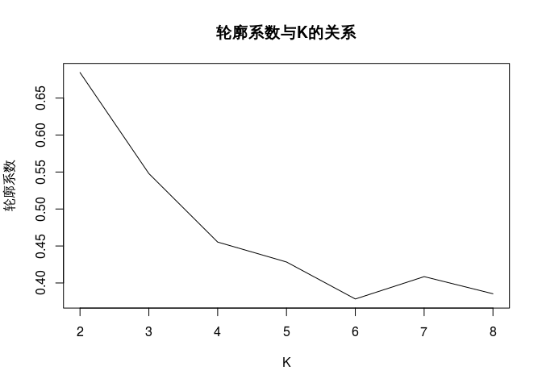
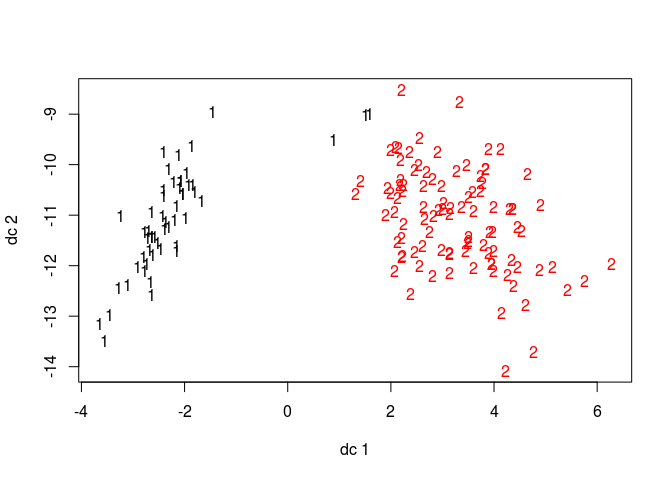

Kmeans
================

-   [功能和使用场景](#功能和使用场景)
    -   [使用场景](#使用场景)
    -   [关键参数](#关键参数)
-   [Kmeans聚类测试用例](#kmeans聚类测试用例)
    -   [输入数据](#输入数据)
-   [自定义函数计算K值的轮廓系数来确定最好的K值，默认的最大迭代次数为10](#自定义函数计算k值的轮廓系数来确定最好的k值默认的最大迭代次数为10)
-   [可以看到如下的示意图](#可以看到如下的示意图)
    -   [显示K-均值聚类结果](#显示k-均值聚类结果)
    -   [生成聚类图](#生成聚类图)

功能和使用场景
==============

使用场景
--------

K-means算法主要用于求解聚类问题。 K-Means算法是无监督的聚类算法，运用十分广泛。

K-Means算法的思想是，对于给定的样本集，按照样本之间的距离大小，将样本集划分为K个簇。让簇内的点尽量紧密的连在一起，而让簇间的距离尽量的大，两个对象之间的距离越近，相似性越高。聚类的结果就是使类内部的同质性高，而类之间的异质性高。

优点：实现起来比较简单，聚类效果也不错；

缺点：具有一定的随机性，聚类中心点数量不同时效果差别也大。

适用场景：应用于维数、数值都很小且连续的数据集，比如：从随机分布的事物集合中将相同事物进行分组。。

关键参数
--------

按照重要程度，Kmeans的主要参数包括：

-   K值：聚类中心点个数；
-   max.iter：聚类的最大迭代次数，默认值是10；
-   轮廓系数：确定最优K，轮廓系数越大越好；

Kmeans聚类测试用例
==================

输入数据
--------

``` r
library(fpc)
data(iris)
data <- iris[,c(1:3)]
head(data)
```

    ##   Sepal.Length Sepal.Width Petal.Length
    ## 1          5.1         3.5          1.4
    ## 2          4.9         3.0          1.4
    ## 3          4.7         3.2          1.3
    ## 4          4.6         3.1          1.5
    ## 5          5.0         3.6          1.4
    ## 6          5.4         3.9          1.7

自定义函数计算K值的轮廓系数来确定最好的K值，默认的最大迭代次数为10
==================================================================

``` r
# k取2到8，评估K
library(fpc)
K <- 2:8
round <- 10 # 每次迭代10次，避免局部最优
rst <- sapply(K, function(i){
  print(paste("K=",i))
  mean(sapply(1:round,function(r){
    print(paste("Round",r))
    result <- kmeans(data, i)
    stats <- cluster.stats(dist(data), result$cluster)
    stats$avg.silwidth
  }))
})
```

    ## [1] "K= 2"
    ## [1] "Round 1"
    ## [1] "Round 2"
    ## [1] "Round 3"
    ## [1] "Round 4"
    ## [1] "Round 5"
    ## [1] "Round 6"
    ## [1] "Round 7"
    ## [1] "Round 8"
    ## [1] "Round 9"
    ## [1] "Round 10"
    ## [1] "K= 3"
    ## [1] "Round 1"
    ## [1] "Round 2"
    ## [1] "Round 3"
    ## [1] "Round 4"
    ## [1] "Round 5"
    ## [1] "Round 6"
    ## [1] "Round 7"
    ## [1] "Round 8"
    ## [1] "Round 9"
    ## [1] "Round 10"
    ## [1] "K= 4"
    ## [1] "Round 1"
    ## [1] "Round 2"
    ## [1] "Round 3"
    ## [1] "Round 4"
    ## [1] "Round 5"
    ## [1] "Round 6"
    ## [1] "Round 7"
    ## [1] "Round 8"
    ## [1] "Round 9"
    ## [1] "Round 10"
    ## [1] "K= 5"
    ## [1] "Round 1"
    ## [1] "Round 2"
    ## [1] "Round 3"
    ## [1] "Round 4"
    ## [1] "Round 5"
    ## [1] "Round 6"
    ## [1] "Round 7"
    ## [1] "Round 8"
    ## [1] "Round 9"
    ## [1] "Round 10"
    ## [1] "K= 6"
    ## [1] "Round 1"
    ## [1] "Round 2"
    ## [1] "Round 3"
    ## [1] "Round 4"
    ## [1] "Round 5"
    ## [1] "Round 6"
    ## [1] "Round 7"
    ## [1] "Round 8"
    ## [1] "Round 9"
    ## [1] "Round 10"
    ## [1] "K= 7"
    ## [1] "Round 1"
    ## [1] "Round 2"
    ## [1] "Round 3"
    ## [1] "Round 4"
    ## [1] "Round 5"
    ## [1] "Round 6"
    ## [1] "Round 7"
    ## [1] "Round 8"
    ## [1] "Round 9"
    ## [1] "Round 10"
    ## [1] "K= 8"
    ## [1] "Round 1"
    ## [1] "Round 2"
    ## [1] "Round 3"
    ## [1] "Round 4"
    ## [1] "Round 5"
    ## [1] "Round 6"
    ## [1] "Round 7"
    ## [1] "Round 8"
    ## [1] "Round 9"
    ## [1] "Round 10"

可以看到如下的示意图
====================

``` r
plot(K,rst,type='l',main='轮廓系数与K的关系', ylab='轮廓系数') 
```

 \#轮廓系数越大越好

显示K-均值聚类结果
------------------

``` r
(kmeans <- kmeans(na.omit(data), 2))
```

    ## K-means clustering with 2 clusters of sizes 53, 97
    ## 
    ## Cluster means:
    ##   Sepal.Length Sepal.Width Petal.Length
    ## 1     5.005660    3.369811     1.560377
    ## 2     6.301031    2.886598     4.958763
    ## 
    ## Clustering vector:
    ##   1   2   3   4   5   6   7   8   9  10  11  12  13  14  15  16  17  18 
    ##   1   1   1   1   1   1   1   1   1   1   1   1   1   1   1   1   1   1 
    ##  19  20  21  22  23  24  25  26  27  28  29  30  31  32  33  34  35  36 
    ##   1   1   1   1   1   1   1   1   1   1   1   1   1   1   1   1   1   1 
    ##  37  38  39  40  41  42  43  44  45  46  47  48  49  50  51  52  53  54 
    ##   1   1   1   1   1   1   1   1   1   1   1   1   1   1   2   2   2   2 
    ##  55  56  57  58  59  60  61  62  63  64  65  66  67  68  69  70  71  72 
    ##   2   2   2   1   2   2   2   2   2   2   2   2   2   2   2   2   2   2 
    ##  73  74  75  76  77  78  79  80  81  82  83  84  85  86  87  88  89  90 
    ##   2   2   2   2   2   2   2   2   2   2   2   2   2   2   2   2   2   2 
    ##  91  92  93  94  95  96  97  98  99 100 101 102 103 104 105 106 107 108 
    ##   2   2   2   1   2   2   2   2   1   2   2   2   2   2   2   2   2   2 
    ## 109 110 111 112 113 114 115 116 117 118 119 120 121 122 123 124 125 126 
    ##   2   2   2   2   2   2   2   2   2   2   2   2   2   2   2   2   2   2 
    ## 127 128 129 130 131 132 133 134 135 136 137 138 139 140 141 142 143 144 
    ##   2   2   2   2   2   2   2   2   2   2   2   2   2   2   2   2   2   2 
    ## 145 146 147 148 149 150 
    ##   2   2   2   2   2   2 
    ## 
    ## Within cluster sum of squares by cluster:
    ## [1]  26.24679 107.21753
    ##  (between_SS / total_SS =  77.6 %)
    ## 
    ## Available components:
    ## 
    ## [1] "cluster"      "centers"      "totss"        "withinss"    
    ## [5] "tot.withinss" "betweenss"    "size"         "iter"        
    ## [9] "ifault"

生成聚类图
----------

``` r
plotcluster(na.omit(data), kmeans$cluster)
```


