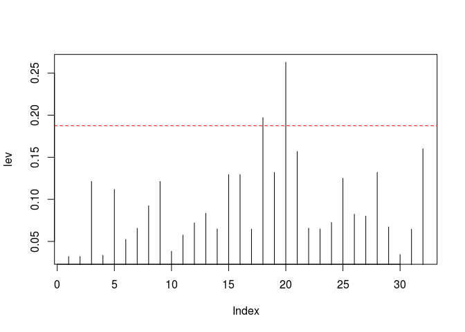

特征异常平滑
================

-   [功能和使用场景](#功能和使用场景)
    -   [特征异常因子](#特征异常因子)
    -   [特征异常的判定规则](#特征异常的判定规则)
-   [参数分析](#参数分析)
-   [实例分析](#实例分析)
-   [算子实现方案](#算子实现方案)
    -   [基于 R 函数](#基于-r-函数)
    -   [Java/Scala实现](#javascala实现)

功能和使用场景
==============

对于有监督学习问题，当观测数为  时，有观测值向量  （长度为 ）和拟合值向量 ，则满足如下特征的矩阵  叫做 hat matrix （因为方程左边变量叫 *hat y*）:


将这个等式在行方向上展开：


 可知其中的  项表征了第  个观测中实际值  对估计值  的贡献大小。 由  组成的向量具有如下性质（[Using Leverages to Help Identify Extreme x Values](https://onlinecourses.science.psu.edu/stat501/node/338/)）：

-    表示第  个观测值  与平均值  差距的大小；

-   ![h\_{ii} \\in \[0, 1\]](https://latex.codecogs.com/png.latex?h_%7Bii%7D%20%5Cin%20%5B0%2C%201%5D "h_{ii} \in [0, 1]")

-   

其中  是特征数。

特征异常因子
------------

特征异常 (high leverage) 指特征变量（独立变量）由于某些原因，例如仪器输出异常、录入错误等，取到了不合理的值。 从数值计算的角度看，异常特征值就是与该特征的平均值的差距超出了合理范围的值，实践中以与特征平均值的距离作为特征异常的衡量指标，距离越远，属于异常值的可能性就越高（ISL，式(3.37)）：

 ^ 2}{\sum_{j=1}^n(x_j - \bar x) ^ 2}
")

当  时，；

当 与 特征平均值  的差距较大时， 对应的误差， ^ 2")，在误差总和， ^ 2") 所占比重很大，，证明过程如下： 假设特征  包含  个观测，其中  个正常值取值均为 ，另有一个异常值 ，也就是说  对应的观测贡献了所有的误差。这时特征均值为：

 x_1 + x_2}{n}
")

则正常项（共  个）与均值的方差为（令  ^ 2")）：

 ^ 2 = (\frac{x_1 - x_2}{n}) ^ 2 = \frac{1}{n ^ 2} S
")

异常值与均值的方差为：

 ^ 2 = (\frac{n - 1}{n} (x_2 - x_1)) ^ 2 = \frac{(n - 1) ^ 2}{n ^ 2} S
")

异常观测的  值为：

 \sigma_n + \sigma_a} \\
= \frac1n + \frac{\frac{(n - 1) ^ 2}{n ^ 2} S}{\frac{n - 1}{n ^ 2} S + \frac{(n - 1) ^ 2}{n ^ 2} S} \\
= \frac1n + \frac{(n - 1) ^ 2}{n - 1 + (n - 1) ^ 2} \\
= 1
")

正常观测的  值为：

 \sigma_n + \sigma_a} \\
= \frac1n + \frac{\frac{1}{n ^ 2} S}{\frac{n - 1}{n ^ 2} S + \frac{(n - 1) ^ 2}{n ^ 2} S} \\
= \frac1n + \frac{1}{n - 1 + (n - 1) ^ 2} \\
= \frac1{n - 1}
")

故可知异常特征值的  值大于正常值的  值，且随着观测数量的增加，差异不断升高，当  时，二者之差 。

特征异常的判定规则
------------------

由于所有观测点的  值的平均值为  / n")（这里  为模型中特征的数量，参考 ISL p98），一般取  / n") 的倍数作为判断特征异常的阈值，超过这个值视为特征异常值。

异常特征虽然往往是由于错误导致的，但并不必然导致拟合错误，以单变量拟合为例，假设有数据集 ![y = 3 x + 1, \\; x \\in \[1, 2\]](https://latex.codecogs.com/png.latex?y%20%3D%203%20x%20%2B%201%2C%20%5C%3B%20x%20%5Cin%20%5B1%2C%202%5D "y = 3 x + 1, \; x \in [1, 2]")，对于观测点 ")，虽然特征 ![3 \\notin \[1,2\]](https://latex.codecogs.com/png.latex?3%20%5Cnotin%20%5B1%2C2%5D "3 \notin [1,2]")，属于异常点，但并不影响拟合函数（）。

参数分析
========

异常系数  通常取2或者3（参考 [Using Leverages to Help Identify Extreme x Values](https://onlinecourses.science.psu.edu/stat501/node/338/)）。

算子的 **输入** 是一个 dataframe，**输出** 是去掉异常点后的dataframe.

实例分析
========

算子的 \*\* 输入\*\* 是1974年 "Moter Trend US" 杂志选取的32款车型11个方面的性能指标形成的 `mtcars` 数据集：

``` r
dim(mtcars)
```

    ## [1] 32 11

``` r
rownames(mtcars)
```

    ##  [1] "Mazda RX4"           "Mazda RX4 Wag"       "Datsun 710"         
    ##  [4] "Hornet 4 Drive"      "Hornet Sportabout"   "Valiant"            
    ##  [7] "Duster 360"          "Merc 240D"           "Merc 230"           
    ## [10] "Merc 280"            "Merc 280C"           "Merc 450SE"         
    ## [13] "Merc 450SL"          "Merc 450SLC"         "Cadillac Fleetwood" 
    ## [16] "Lincoln Continental" "Chrysler Imperial"   "Fiat 128"           
    ## [19] "Honda Civic"         "Toyota Corolla"      "Toyota Corona"      
    ## [22] "Dodge Challenger"    "AMC Javelin"         "Camaro Z28"         
    ## [25] "Pontiac Firebird"    "Fiat X1-9"           "Porsche 914-2"      
    ## [28] "Lotus Europa"        "Ford Pantera L"      "Ferrari Dino"       
    ## [31] "Maserati Bora"       "Volvo 142E"

下面选取其中 汽缸数 和 百英里油耗 两个特征，**参数** 取 ，通过  值分析其中的特征异常值：

``` r
mdl <- lm(hp ~ cyl + mpg, data = mtcars)
k <- 2
h.max <- k * (2 + 1) / nrow(mtcars)   # 2表示模型中包含2个特征变量: cyl 和 mpg
lev <- hatvalues(mdl)      # 计算数据集中每个观测的h值
plot(lev, type = 'h')
abline(h = h.max, col = 'red', lty = 2)
```



筛选出 leverage 超出阈值的观测点：

``` r
rownames(mtcars[lev > h.max, ])
```

    ## [1] "Fiat 128"       "Toyota Corolla"

去掉 leverage 超出阈值的观测点，形成算子的 **输出**：

``` r
newcar <- mtcars[lev <= h.max, ]
dim(newcar)
```

    ## [1] 30 11

``` r
rownames(newcar)
```

    ##  [1] "Mazda RX4"           "Mazda RX4 Wag"       "Datsun 710"         
    ##  [4] "Hornet 4 Drive"      "Hornet Sportabout"   "Valiant"            
    ##  [7] "Duster 360"          "Merc 240D"           "Merc 230"           
    ## [10] "Merc 280"            "Merc 280C"           "Merc 450SE"         
    ## [13] "Merc 450SL"          "Merc 450SLC"         "Cadillac Fleetwood" 
    ## [16] "Lincoln Continental" "Chrysler Imperial"   "Honda Civic"        
    ## [19] "Toyota Corona"       "Dodge Challenger"    "AMC Javelin"        
    ## [22] "Camaro Z28"          "Pontiac Firebird"    "Fiat X1-9"          
    ## [25] "Porsche 914-2"       "Lotus Europa"        "Ford Pantera L"     
    ## [28] "Ferrari Dino"        "Maserati Bora"       "Volvo 142E"

在多特征回归模型中（特征数量大于1），特征异常不针对某个具体的特征，而是所有特征综合作用的结果。

算子实现方案
============

基于 R 函数
-----------

如上 实例分析 一节所示，R 中的 `hatvalues()` 函数用于计算特征异常因子 ，超出  / n") 的  值被标记为特征异常值（这里  是用户指定的阈值因子， 是模型特征数， 是模型观测数）。

Java/Scala实现
--------------

如果不引入 R，可参考 `hatvalues()` 的实现手工转换为 Java/Scala 实现，由于 `hatvalues()` 是 `lm.lm.influence()` 函数返回结果中 `hat` 部分的别名，其实现如下：

``` r
getAnywhere(lm.influence)
```

    ## A single object matching 'lm.influence' was found
    ## It was found in the following places
    ##   package:stats
    ##   namespace:stats
    ## with value
    ## 
    ## function (model, do.coef = TRUE) 
    ## {
    ##     wt.res <- weighted.residuals(model)
    ##     e <- na.omit(wt.res)
    ##     if (model$rank == 0) {
    ##         n <- length(wt.res)
    ##         sigma <- sqrt(deviance(model)/df.residual(model))
    ##         res <- list(hat = rep(0, n), coefficients = matrix(0, 
    ##             n, 0), sigma = rep(sigma, n), wt.res = e)
    ##     }
    ##     else {
    ##         e[abs(e) < 100 * .Machine$double.eps * median(abs(e))] <- 0
    ##         mqr <- qr.lm(model)
    ##         n <- as.integer(nrow(mqr$qr))
    ##         if (is.na(n)) 
    ##             stop("invalid model QR matrix")
    ##         if (NROW(e) != n) 
    ##             stop("non-NA residual length does not match cases used in fitting")
    ##         do.coef <- as.logical(do.coef)
    ##         tol <- 10 * .Machine$double.eps
    ##         res <- .Call(C_influence, mqr, do.coef, e, tol)
    ##         if (!is.null(model$na.action)) {
    ##             hat <- naresid(model$na.action, res$hat)
    ##             hat[is.na(hat)] <- 0
    ##             res$hat <- hat
    ##             if (do.coef) {
    ##                 coefficients <- naresid(model$na.action, res$coefficients)
    ##                 coefficients[is.na(coefficients)] <- 0
    ##                 res$coefficients <- coefficients
    ##             }
    ##             sigma <- naresid(model$na.action, res$sigma)
    ##             sigma[is.na(sigma)] <- sqrt(deviance(model)/df.residual(model))
    ##             res$sigma <- sigma
    ##         }
    ##     }
    ##     res$wt.res <- naresid(model$na.action, res$wt.res)
    ##     res$hat[res$hat > 1 - 10 * .Machine$double.eps] <- 1
    ##     names(res$hat) <- names(res$sigma) <- names(res$wt.res)
    ##     if (do.coef) {
    ##         rownames(res$coefficients) <- names(res$wt.res)
    ##         colnames(res$coefficients) <- names(coef(model))[!is.na(coef(model))]
    ##     }
    ##     res
    ## }
    ## <bytecode: 0x2048728>
    ## <environment: namespace:stats>
