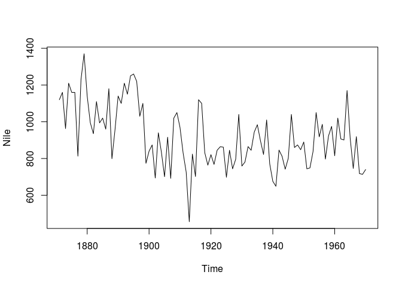
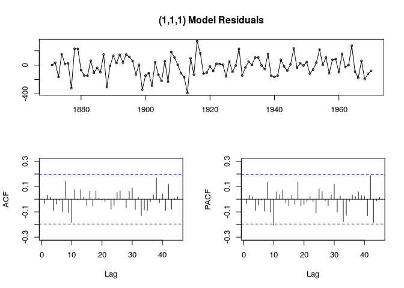

基于ARIMA的时间序列分析和预测
================

-   [稳态时间序列](#稳态时间序列)
-   [自回归](#自回归)
-   [移动平均](#移动平均)
-   [ARIMA](#arima)
-   [典型场景分析](#典型场景分析)
-   [参考文献](#参考文献)

稳态时间序列
============

一个时间序列是*稳态*的 (stationary)，需要满足如下条件：

-   序列平均值不随时间变化；

-   序列的方差 (variance) 不随时间变化；

-   序列上距离相等的两组时间点上值的协方差 (covariance) 不随点的移动而变化；

稳态是预测时间序列的前提条件。

自回归
======

如果时间序列变量  在 时间点  上的值是过去  个时间点上值的线性组合，则  是  阶自回归的：


其中  可以理解为线性回归中的截距（intercept）， 是随机扰动。

移动平均
========

如果时间序列变量  在 时间点  上的值是当前以及过去  个时间点上随即扰动项的线性组合，则此时间序列是  阶移动平均的：


 \# ARMA

满足阶自回归和阶移动平均的稳态时间序列可以表示为：


记为：


")

ARIMA
=====

为了能够处理非稳态时间序列，采用差分 (difference) 处理非稳态序列，直到它符合稳态条件。 一个非稳态时间序列经过  次差分后变为 ")，则这个时间序列记为：


")

当  确定后，将时间序列代入式可确定模型参数。

典型场景分析
============

这里采用1871 ~ 1970年尼罗河水量作为输入数据创建ARIMA模型：

``` r
library(forecast)
plot(Nile)
```



``` r
mdl <- auto.arima(Nile)
summary(mdl)
```

    ## Series: Nile 
    ## ARIMA(1,1,1) 
    ## 
    ## Coefficients:
    ##          ar1      ma1
    ##       0.2544  -0.8741
    ## s.e.  0.1194   0.0605
    ## 
    ## sigma^2 estimated as 20177:  log likelihood=-630.63
    ## AIC=1267.25   AICc=1267.51   BIC=1275.04
    ## 
    ## Training set error measures:
    ##                     ME     RMSE      MAE       MPE     MAPE     MASE
    ## Training set -16.06603 139.8986 109.9998 -4.005967 12.78745 0.825499
    ##                     ACF1
    ## Training set -0.03228482

可知这是一个 (1,1,1) 阶ARIMA模型，，，模型残差：

``` r
tsdisplay(residuals(mdl), lag.max=45, main='(1,1,1) Model Residuals')
```



可以看到残差基本符合标准正态分布，满足式中的要求。

基于上述参数可以预测未来5年（1971 ~ 1975）的尼罗河水量：

``` r
predict(mdl, 5)
```

    ## $pred
    ## Time Series:
    ## Start = 1971 
    ## End = 1975 
    ## Frequency = 1 
    ## [1] 816.1813 835.5596 840.4889 841.7428 842.0617
    ## 
    ## $se
    ## Time Series:
    ## Start = 1971 
    ## End = 1975 
    ## Frequency = 1 
    ## [1] 142.0455 151.9673 155.2215 157.3709 159.2623

参考文献
========

-   <https://www.analyticsvidhya.com/blog/2015/12/complete-tutorial-time-series-modeling/>

-   <https://rstudio-pubs-static.s3.amazonaws.com/345790_3c1459661736433382863ed19c30ea55.html>

-
