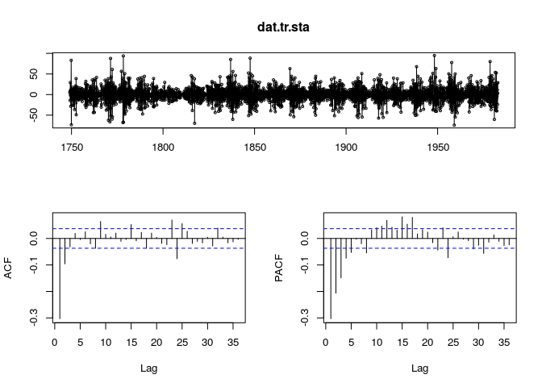

ARMA模型介绍
================

-   [功能和使用场景](#功能和使用场景)
-   [参数分析](#参数分析)
    -   [生成稳态序列](#生成稳态序列)
    -   [自相关系数和移动平均系数](#自相关系数和移动平均系数)
    -   [与 ARIMA 对比](#与-arima-对比)
-   [数据导入/导出](#数据导入导出)
-   [参考文献](#参考文献)

功能和使用场景
==============

一个时间序列是*稳态*的 (stationary)，需要满足如下条件：

-   序列平均值不随时间变化；

-   序列的方差 (variance) 不随时间变化；

-   序列上距离相等的两组时间点上值的协方差 (covariance) 不随点的移动而变化；

满足阶自回归和阶移动平均的稳态时间序列可以表示为：


记为：


")

当  确定后，将时间序列代入 式(1) 可确定模型参数。

优点：比 AR 模型有更广泛的适用性;

缺点：不能处理非稳态时间序列。

参数分析
========

以1749年 ~ 1983年太阳黑子月度平均值为例，比较不同计算方法的预测精度。 首先以1982年12月为界切分训练和测试集：

``` r
dat.train <- window(sunspots, end = c(1982, 12))
dat.test <- window(sunspots, start = c(1983, 1))
head(dat.train)
```

    ## [1] 58.0 62.6 70.0 55.7 85.0 83.5

可以看到本算法的 **输入** 是一个从1749年1月开始的时间序列。

生成稳态序列
------------

对于一个非稳态序列，可以通过不断进行差分的方法去掉信号中的低频成分，直到满足稳态条件为止，这个过程在R中的实现过程是：

``` r
library(forecast)
d <- ndiffs(dat.train); d
```

    ## [1] 1

需要进行一次差分将训练集转为稳态数据：

``` r
dat.tr.sta <- diff(dat.train, differences = 1)
```

自相关系数和移动平均系数
------------------------

显示时间序列，及其根据偏自相关 (PACF) 、自相关 (ACF) 图：

``` r
tsdisplay(dat.tr.sta)
```



根据PACF图确定自回归系数 ，这里取2，根据ACF图确定移动平均系数  为2。

根据以上参数拟合ARMA模型：

``` r
library(tseries)
am.mdl <- arma(dat.tr.sta, order = c(2, 2))
summary(am.mdl)
```

    ## 
    ## Call:
    ## arma(x = dat.tr.sta, order = c(2, 2))
    ## 
    ## Model:
    ## ARMA(2,2)
    ## 
    ## Residuals:
    ##     Min      1Q  Median      3Q     Max 
    ## -67.014  -7.939  -0.287   7.526  87.869 
    ## 
    ## Coefficient(s):
    ##            Estimate  Std. Error  t value Pr(>|t|)    
    ## ar1         1.39942     0.03335   41.957   <2e-16 ***
    ## ar2        -0.44822     0.03167  -14.153   <2e-16 ***
    ## ma1        -1.76950     0.02456  -72.036   <2e-16 ***
    ## ma2         0.80839     0.02370   34.104   <2e-16 ***
    ## intercept   0.00394     0.01153    0.342    0.733    
    ## ---
    ## Signif. codes:  0 '***' 0.001 '**' 0.01 '*' 0.05 '.' 0.1 ' ' 1
    ## 
    ## Fit:
    ## sigma^2 estimated as 244.1,  Conditional Sum-of-Squares = 684461.8,  AIC = 23407.43

随机变量 ，且  与  相关，则  与  的相关性中，去掉由于  与 、 都相关造成的  与  相关部分，剩下的相关性就是  与  的 *偏自相关系数*。

与 ARIMA 对比
-------------

``` r
library(forecast)
arm.mdl <- auto.arima(dat.train)   # 使用自动确定系数的 arima 方法构建 ARIMA 模型
summary(arm.mdl)
```

    ## Series: dat.train 
    ## ARIMA(2,1,2) 
    ## 
    ## Coefficients:
    ##          ar1      ar2      ma1     ma2
    ##       1.3432  -0.3937  -1.7688  0.8082
    ## s.e.  0.0309   0.0292   0.0211  0.0200
    ## 
    ## sigma^2 estimated as 243.3:  log likelihood=-11692.44
    ## AIC=23394.88   AICc=23394.9   BIC=23424.58
    ## 
    ## Training set error measures:
    ##                      ME     RMSE      MAE MPE MAPE      MASE        ACF1
    ## Training set 0.01325995 15.58358 11.01217 NaN  Inf 0.4795732 -0.01121674

预测太阳黑子的在测试集上的月度数量：

``` r
# forecast(am.mdl, 12)
pred.arm <- predict(arm.mdl, n.ahead = 12)
pred.arm
```

    ## $pred
    ##            Jan       Feb       Mar       Apr       May       Jun       Jul
    ## 1983 115.47734 109.71904 106.52032 104.49051 103.02321 101.85134 100.85487
    ##            Aug       Sep       Oct       Nov       Dec
    ## 1983  99.97770  99.19172  98.48129  97.83641  97.24986
    ## 
    ## $se
    ##           Jan      Feb      Mar      Apr      May      Jun      Jul
    ## 1983 15.59747 17.98742 19.12838 19.99641 20.84288 21.75030 22.74408
    ##           Aug      Sep      Oct      Nov      Dec
    ## 1983 23.82594 24.98753 26.21682 27.50112 28.82854

计算此模型的MAE:

``` r
mean(abs(pred.arm$pred - dat.test))
```

    ## [1] 36.25613

数据导入/导出
=============

用下面的脚本生成输入数据，注意要手工在第一行首添加 `id,`：

``` r
library(zoo)
```

    ## 
    ## Attaching package: 'zoo'

    ## The following objects are masked from 'package:base':
    ## 
    ##     as.Date, as.Date.numeric

``` r
timestamp <- as.yearmon(time(dat.train))
inp <- data.frame(time=timestamp, sunspots=dat.train)
write.table(inp, "arma-test-input.csv", quote = FALSE, dec = ".", sep = ",")
```

算子参数：。

参考文献
========

-   [Partial autocorrelation function](https://en.wikipedia.org/wiki/Partial_autocorrelation_function)

-   [Partial Autocorrelation Function in STAT 510](https://onlinecourses.science.psu.edu/stat510/node/62/)

-   [Identifying the numbers of AR or MA terms in an ARIMA model](https://people.duke.edu/~rnau/411arim3.htm)
