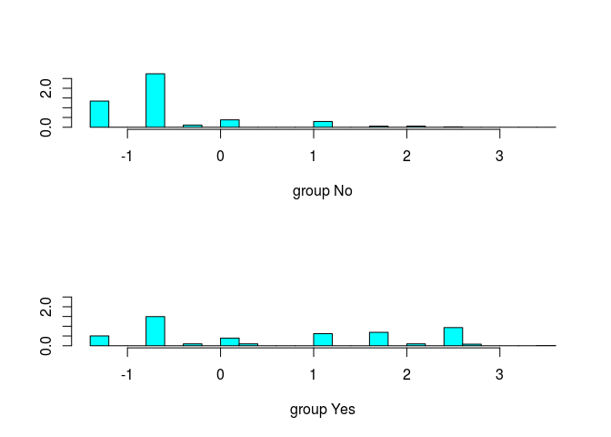

贝叶斯估计
================

-   [功能和使用场景](#功能和使用场景)
-   [参数分析](#参数分析)
-   [实例分析](#实例分析)
    -   [与其他分类方法的比较](#与其他分类方法的比较)
-   [参考文献](#参考文献)

功能和使用场景
==============

贝叶斯估计基于 [贝叶斯定理](https://en.wikipedia.org/wiki/Bayes%27_theorem) 根据已有的先验概率（prior probability）计算出后验概率（posterior probability），并通过比较不同类型中后验概率的大小决定预测类别。在类别型特征彼此独立，或者数值型特征符合正态分布的条件下，贝叶斯估计可以得到理论上的最佳估计。

优点：适合特征为类型值、特征数量不太大、观察数量（可以）非常大的的分析场景，计算过程简单，扩展性好，易实现流式分析（一次训练只需要一个观测），解释性好；

缺点：无法处理特征的组合，不适合处理特征为数值型变量的场景；

参数分析
========

odds: 在需要避免假阳性时，可以通过调整 odds 的值实现，例如在垃圾邮件过滤场景中，可以容忍少量垃圾邮件被标记为正常邮件（假阴性），但需要尽量避免正常邮件被标记为垃圾邮件（假阳性），在计算出阳性和阴性各自的条件概率后，有：

 = \frac{Pr(pos|doc)}{Pr(neg|doc)}
")

假设 ，则只有当 此邮件(`doc`) 是垃圾邮件的概率（")）高于此邮件不是垃圾邮件的概率（") ）3倍时，才将其标记为垃圾邮件。 时为正常邮件，") 时标记为“无法确定”。

实例分析
========

使用贝叶斯估计预测泰坦尼克号乘客和船员是否能够幸存。 输入数据是其中2201人的舱室等级、性别和年龄，响应变量为是否幸存：

``` r
library(e1071)
set.seed(1)
titan.df <- as.data.frame(Titanic)
#Creating data from table
repeating_sequence <- rep.int(seq_len(nrow(titan.df)), titan.df$Freq) #This will repeat each combination equal to the frequency of each combination
#Create the dataset by row repetition created
titan.dat <- titan.df[repeating_sequence,]
#We no longer need the frequency, drop the feature
titan.dat$Freq <- NULL
head(titan.dat)
```

    ##     Class  Sex   Age Survived
    ## 3     3rd Male Child       No
    ## 3.1   3rd Male Child       No
    ## 3.2   3rd Male Child       No
    ## 3.3   3rd Male Child       No
    ## 3.4   3rd Male Child       No
    ## 3.5   3rd Male Child       No

``` r
dim(titan.dat)
```

    ## [1] 2201    4

上面的 data frame `titan.dat` 是本算法的 **输入**，包含3个特征列 *Class*, *Sex* 和 *Age*，以及响应变量（也就是有监督学习中的“标签”）*Survived*。

下面取输入数据中 80% 的观测作为训练集，剩下 20% 作为测试集：

``` r
train <- sample(nrow(titan.dat), nrow(titan.dat) * 0.8)
dat.train <- titan.dat[train, ]
dat.test <- titan.dat[-train, ]
```

基于训练集建立贝叶斯估计模型：

``` r
nb.model <- naiveBayes(Survived ~., data = dat.train)  # 基于输入数据 dat.train 和 公式建立贝叶斯模型
summary(nb.model)
```

    ##         Length Class  Mode     
    ## apriori 2      table  numeric  
    ## tables  3      -none- list     
    ## levels  2      -none- character
    ## call    4      -none- call

``` r
nb.model$tables
```

    ## $Class
    ##      Class
    ## Y            1st        2nd        3rd       Crew
    ##   No  0.07927333 0.11312964 0.35012386 0.45747316
    ##   Yes 0.29143898 0.15664845 0.24225865 0.30965392
    ## 
    ## $Sex
    ##      Sex
    ## Y           Male     Female
    ##   No  0.91577209 0.08422791
    ##   Yes 0.54098361 0.45901639
    ## 
    ## $Age
    ##      Age
    ## Y          Child      Adult
    ##   No  0.03633361 0.96366639
    ##   Yes 0.07468124 0.92531876

训练数据表明女性和孩子的生存概率远高于男性和成人，一等舱到三等舱的生存概率依次下降，船员的生存概率最低。

使用上面训练的模型在测试集上计算预测值，并计算泛化错误率：

``` r
nb.pred <- predict(nb.model, newdata = dat.test)
nb.pred
```

    ##   [1] No  No  No  No  No  No  Yes Yes No  No  No  No  No  No  No  No  No 
    ##  [18] No  No  No  No  No  No  No  No  No  No  No  No  No  No  No  No  No 
    ##  [35] No  No  No  No  No  No  No  No  No  No  No  No  No  No  No  No  No 
    ##  [52] No  No  No  No  No  No  No  No  No  No  No  No  No  No  No  No  No 
    ##  [69] No  No  No  No  No  No  No  No  No  No  No  No  No  No  No  No  No 
    ##  [86] No  No  No  No  No  No  No  No  No  No  No  No  No  No  No  No  No 
    ## [103] No  No  No  No  No  No  No  No  No  No  No  No  No  No  No  No  No 
    ## [120] No  No  No  No  No  No  No  No  No  No  No  No  No  No  No  No  No 
    ## [137] No  No  No  No  No  No  No  No  No  No  No  No  No  No  No  No  No 
    ## [154] No  No  No  No  No  No  No  No  No  No  No  No  No  No  No  No  No 
    ## [171] No  No  No  No  No  No  No  No  No  No  No  No  No  No  No  No  No 
    ## [188] No  No  No  No  No  No  No  No  No  No  No  No  No  No  No  No  No 
    ## [205] No  No  No  No  No  No  No  No  No  No  No  No  No  No  No  No  No 
    ## [222] No  No  No  No  No  No  No  No  No  No  No  No  No  No  No  No  No 
    ## [239] No  No  No  No  No  No  No  No  No  No  No  No  No  No  No  No  No 
    ## [256] No  No  Yes Yes Yes Yes Yes Yes Yes Yes Yes Yes Yes Yes Yes Yes Yes
    ## [273] Yes Yes Yes Yes Yes Yes Yes Yes No  No  No  No  Yes Yes Yes Yes Yes
    ## [290] Yes Yes Yes Yes Yes Yes No  No  No  No  No  No  No  No  No  No  No 
    ## [307] No  No  No  No  No  No  No  No  No  No  No  No  No  No  No  No  No 
    ## [324] No  No  No  No  No  No  No  No  No  No  No  No  No  No  No  No  No 
    ## [341] No  No  No  No  No  No  No  No  No  No  No  No  No  No  No  No  No 
    ## [358] No  No  No  Yes Yes Yes Yes Yes Yes Yes Yes Yes Yes Yes Yes Yes Yes
    ## [375] Yes Yes Yes Yes Yes Yes Yes Yes Yes Yes Yes Yes Yes Yes Yes Yes Yes
    ## [392] Yes Yes Yes Yes Yes Yes Yes Yes Yes Yes Yes Yes Yes Yes Yes Yes Yes
    ## [409] Yes Yes Yes Yes Yes Yes Yes Yes Yes Yes Yes Yes Yes Yes Yes Yes Yes
    ## [426] Yes Yes Yes Yes Yes Yes Yes Yes Yes Yes Yes Yes Yes Yes Yes Yes
    ## Levels: No Yes

``` r
table(nb.pred, dat.test$Survived)
```

    ##        
    ## nb.pred  No Yes
    ##     No  255  69
    ##     Yes  24  93

``` r
(24 + 69) / (255 + 69 + 24 + 93)
```

    ## [1] 0.2108844

上面的向量 `nb.pred` 就是算法的计算结果，将它与测试集的特征列组合形成算法的 **输出**：

``` r
output <- dat.test
output$Survived <- nb.pred
head(output)
```

    ##      Class  Sex   Age Survived
    ## 3      3rd Male Child       No
    ## 3.21   3rd Male Child       No
    ## 3.22   3rd Male Child       No
    ## 3.26   3rd Male Child       No
    ## 3.32   3rd Male Child       No
    ## 3.34   3rd Male Child       No

与其他分类方法的比较
--------------------

这里以逻辑回归为例，比较二者泛化错误率：

``` r
lr.model <- glm(Survived ~ ., data = dat.train, family = binomial)
lr.prob <- predict(lr.model, newdata = dat.test, type = 'response')
lr.pred <- ifelse(lr.prob > 0.5, 'Yes', 'No')
table(prediction = lr.pred, truth = dat.test$Survived)
```

    ##           truth
    ## prediction  No Yes
    ##        No  255  69
    ##        Yes  24  93

与贝叶斯估计的泛化错误率一致。

使用LDA模型的泛化错误率：

``` r
library(MASS)
lda.model <- lda(Survived ~ ., data = dat.train)
plot(lda.model)
```



``` r
lda.pred <- predict(lda.model, newdata = dat.test)
table(prediction = lda.pred$class, truth = dat.test$Survived)
```

    ##           truth
    ## prediction  No Yes
    ##        No  255  69
    ##        Yes  24  93

两个模型的泛化错误率都是 。 说明在当前场景中，逻辑回归和LDA模型都可以给出理想的分类结果。

参考文献
========

-   [Understanding Naïve Bayes Classifier Using R](https://www.r-bloggers.com/understanding-naive-bayes-classifier-using-r/)

-   [Bayesian Estimation](https://onlinecourses.science.psu.edu/stat414/node/241/)

-   [Linear Discriminant Analysis vs Naive Bayes](https://stackoverflow.com/questions/46396552/linear-discriminant-analysis-vs-naive-bayes)

-   [Bayes error rate](https://en.wikipedia.org/wiki/Bayes_error_rate)
