贝叶斯估计
================

-   [二项分布](#二项分布)
-   [似然函数](#似然函数)
-   [功能和使用场景](#功能和使用场景)
    -   [二项分布场景](#二项分布场景)
    -   [正态分布场景](#正态分布场景)
-   [实例分析](#实例分析)
-   [参考文献](#参考文献)

贝叶斯估计和最大似然估计（MLE）都是参数估计，即基于一组给定的数据（证据）推断某个参数。 二者的区别在于： 最大似然估计基于概率的频率观点，认为样本是随机的，参数是确定的，参数估计是求确定的未知数的过程，即点估计； 贝叶斯估计则基于概率的贝叶斯观点，认为样本是固定的，参数是随机变量，对参数的估计，实际上是确定参数的分布。

不论哪种估计，首先都需要了解似然（likelihood）的概念，作为先验概率和后验概率之间的桥梁，下面首先通过抛硬币场景（二项分布）介绍什么是似然函数，如何计算似然函数，再导出贝叶斯估计，最后是将贝叶斯估计应用于日常实践中的实例分析。

二项分布
========

一次伯努利（Bernoulli）实验的结果只能是成功/失败，符合伯努利分布的随机变量的可能取值是0和1，取1的概率是 ，取0的概率是 。

一次二项实验由  次独立同分布（independent and identically distributed, iid）的伯努利实验组成，符合二项分布的随机变量可能的取值是  次实验后结果为1（成功）的次数 ![\[0..n\]](https://latex.codecogs.com/png.latex?%5B0..n%5D "[0..n]")。

[二项分布](https://zh.wikipedia.org/wiki/%E4%BA%8C%E9%A0%85%E5%88%86%E4%BD%88) ") 的定义：  次独立的互斥实验（只有0/1两种结果）中，**每次**实验成功的概率为 ，结果为1的次数。

P.S.: 在 **一次** 实验中说概率，似乎不符合严格的频率学派对概率的定义？

二项分布随机变量的概率质量函数（ 取到  值的概率）：

 = Pr(X = k) = C^n_k p ^ k (1 - p)^{n - k}
")

其中  是  个元素中取出  个元素组成的集合的数量：

!}
")

 从上式不难得到

 = f(n - k, n, 1 - p)
")

例如：一枚75%正面的硬币抛10次，出现6次正面的概率，等于它（25%反面）抛10次出现4次反面的概率。

假设一个硬币是没有作弊的，即正反两面出现的概率都是0.5，则抛10次硬币中出现6次正面的概率是：

 = C^{10}_6 \times 0.5^6 \times (1 - 0.5) ^ {10 - 6} = 0.205
")

对应的R实现：

``` r
dbinom(6, 10, 0.5)
```

    ## [1] 0.2050781

如果是作弊的硬币，出现正面的概率是 0.75，则抛10次硬币中出现6次正面的概率是：

 = C^{10}_6 \times 0.75^6 \times (1 - 0.75) ^ {10 - 6} = 0.146
")

对应的R实现：

``` r
dbinom(6, 10, 0.75)
```

    ## [1] 0.145998

为什么硬币出现正面的概率升高了（从0.5到0.75），出现6次正面的概率反而从0.205下降到了0.146？

似然函数
========

基于一组给定数据D，假设H的似然度(likelihood)，与基于假设H（假设H为真）得到数据集D的概率成正比：

 \propto P(D|H)
")

当单次抛硬币为正面的概率从0.01到0.99时，10次中出现6次正面的概率（")）变化曲线如下：

``` r
h = 6
n = 10
p <- seq(0.01, 0.99, length.out = 99)
binom.den <- dbinom(h, n, p)
plot(p, binom.den, type = 'l', xlab = '单次正面概率p', ylab = 'f(6, 10, p)')
abline(v = h / n, lty = 5, col = 'red')
points(p[which.max(binom.den)], max(binom.den), cex = 1.5, col = 'red', pch = 16)
```

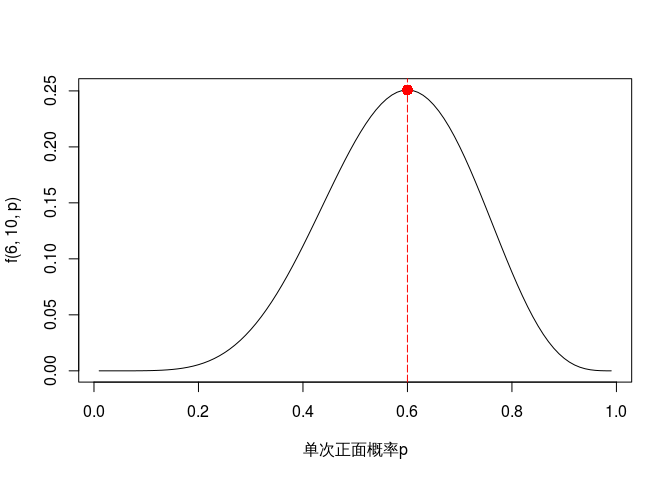

使用标准化似然函数变化曲线比较未作弊和作弊硬币出现6次正面的似然度：

``` r
LR <- function(h, n, p1=.5, p2=.75){
        # p2 标准化似然值：p2似然值与MLE之比
        L1 <- dbinom(h, n, p1) / dbinom(h, n, h / n)
        # p2 标准化似然值：p2似然值与MLE之比
        L2 <- dbinom(h, n, p2) / dbinom(h, n, h / n)
        # p1, p2 的似然函数比
        Ratio <- dbinom(h, n, p1)/dbinom(h, n, p2)
        curve((dbinom(h, n, x) / max(dbinom(h, n, x))),
              xlim = c(0,1),
              ylab = "标准化似然值",
              xlab = "出现正面的概率",
              las=1,
              main = "抛硬币的似然函数比较",
              lwd = 3)
        points(p1, L1, cex = 2, pch = 21, bg = "cyan")
        points(p2, L2, cex = 2, pch = 21, bg = "cyan")
        lines(c(p1, p2), c(L1, L1), lwd = 3, lty = 2, col = "cyan")
        lines(c(p2, p2), c(L1, L2), lwd = 3, lty = 2, col = "cyan")
        abline(v = h / n, lty = 5, lwd = 1, col = "grey73")
        return(Ratio)
}
LR(6, 10)
```

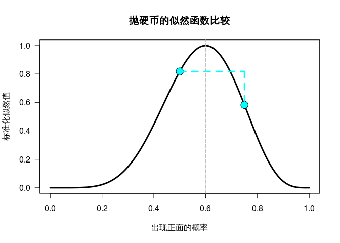

    ## [1] 1.404664

可以看到，要使抛10次中出现6次的概率最大，应该将一次抛硬币出现正面的概率调整为0.6，而0.75与0.6的距离，大于0.5与0.6的距离，所以出现6次正面的概率反而下降了。

功能和使用场景
==============

基于下面的定义：

-   ")：没有看到数据集前对假设估计的概率，即先验概率；

-   ")：看到数据集后对假设的重新估计，也就是我们想要得到的答案；

-   ")：似然概率，即如果假设  是真的，能看到现有数据集的概率；

-   ")：数据集  在任何假设下出现的概率，一般作为标准化因子；

贝叶斯公式可以表述为：

 = \frac{p(D|H)p(H)}{p(D)}")

可知后验概率 正比于 似然函数与先验概率的乘积：


贝叶斯估计的计算过程就是通过假设  的似然函数更新先验估计的过程，具体包括如下步骤：

1.  定义先验概率；

2.  收集数据；

3.  基于收集到的数据计算出后验概率，或者叫做更新先验概率；

4.  分析后验概率的统计特征（均值、方差、分布区间等）；

所以贝叶斯估计广义上的 **输入** 包括先验概率的分布和一个数据集， **输出** 是后验概率的分布。 由于相同的先验概率可以通过接收不同的数据集形成不同的后验概率分布（见下面“实例分析”一节）， 可以将先验概率的分布作为算子的 **参数**，将数据集  作为算子的输入。

当后验概率和先验概率的分布相同时，称先验概率和假设H的似然函数（以及对应的数据集D）是共轭（[conjugate prior](https://en.wikipedia.org/wiki/Conjugate_prior)）的。 常用组合包括：

-   二项分布（数据、似然函数） - Beta分布（先验、后验概率）；

-   正态分布（数据、似然函数） - 正态分布（先验、后验概率）；

贝叶斯估计的特点：

1.  如果先验概率是均匀分布，则后验概率主要由数据决定；

2.  如果先验概率中包含了较多的信息，则后验概率由先验概率和数据共同确定；

3.  先验概率中包含的信息越多，就需要更多的数据才能使后验概率区别于先验概率；

4.  数据量越大，后验概率中数据的影响越大，先验概率的影响越小。

二项分布场景
------------

对于观测数据符合二项分布的场景，先验分布 ") 的概率质量函数是：

 ^ {\beta -1}
")

似然函数（符合二项分布 ")）的概率质量函数：

^{n - x}
")

其中  是  次实验后结果为1的次数。

基于以上定义，得到后验概率的质量函数：

 ^ {\beta + n - x - 1}
")

所以后验概率符合 ") 分布。

先验和后验概率的平均值（mean）： $$ E\_{prior}\[beta(, )\] = \\

E\_{posterior}\[beta(+ z, + n - z)\] = = $$

正态分布场景
------------

对于观测数据符合正态分布的场景，可以从观测数据中计算出样本均值  和 方差 ，已知先验概率符合正态分布 ")，则后验概率符合如下正态分布：

,
  \frac1{\frac1{\sigma_0^2} + \frac n{\sigma ^ 2}})
")

实例分析
========

某人参加飞碟射击比赛，共4轮，每轮25枪，射中记1分，否则记0分。 4轮结束后得分分别为：13, 12, 14, 19。

先验概率可以根据已有的情况定义，这里给出三种常用的情形：

-   均匀分布，射手得分的概率是0.5：")；

-   Jeffreys 先验分布，认为射手成绩很好或者很差，这一分布的优点是能够突出数据的作用，降低先验概率的影响，适合对射手完全不了解的情况：")；

-   基于已有信息：对射手的成绩有一定了解，这里以 ") 为例，即射中4次，射失9次。

首先定义绘图函数：

``` r
plot.beta <- function(PS = 1, PF = 1, k = 0, n = 0, ymax = "auto", main = NULL) {
  x = seq(.001, .999, .001)         # 概率向量
  y1 = dbeta(x, PS, PF)             # 先验概率
  y3 = dbeta(x, PS + k, PF + n - k) # 后验概率
  y2 = dbeta(x, 1 + k, 1 + n - k)   # 似然函数，基于 beta(1,1) 分布

  if (is.numeric(ymax) == T) { y.max = ymax }    
  else ( y.max = 1.25 * max(y1,y2,y3,1.6) )

  if (is.character(main) == T) { Title = main }
  else ( Title = "二项分布数据的先验-后验转换" )

  plot(x, y1, xlim=c(0,1), ylim=c(0, y.max), type = "l", 
       ylab = "概率密度", lty = 2,
       xlab = "射中的概率", las =1, main = Title, lwd = 3,
       cex.lab = 1.5, cex.main = 1.5, col = "skyblue", axes = FALSE)
  axis(1, at = seq(0,1, 0.2)) # 自定义 x 轴
  axis(2, las = 1) # 自定义 y 轴

  if (n != 0) {
    # 如果有新数据，绘制似然和后验曲线
    lines(x, y2, type = "l", col = "darkorange", lwd = 2, lty = 3)
    lines(x, y3, type = "l", col = "darkorchid1", lwd = 5)
    legend("topleft", 
           c("Prior", "Posterior", "Likelihood"), 
           col = c("skyblue", "darkorchid1", "darkorange"), 
           lty = c(2,1,3), lwd = c(3,5,2), bty = "n", 
           y.intersp = .55, x.intersp = .1, seg.len=.7)
  }
}
```

其中 `PS` 表示先验概率中成功的次数， `PF` 表示先验概率中失败的次数，`k` 是数据集中成功的次数，`n` 是数据集的总试验次数。

下面图中，蓝色线表示先验概率，橙色线表示似然函数，紫色线表示后验函数。

先验概率：

``` r
plot.beta(1,1,ymax=3.2,main="均匀分布, Beta(1,1)")
```

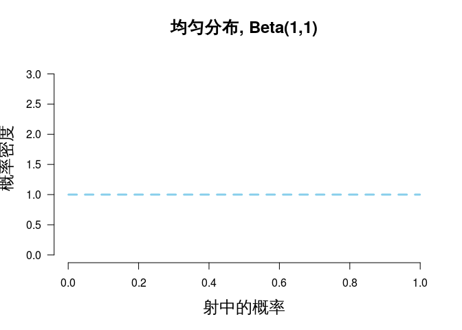

``` r
plot.beta(.5,.5,ymax=3.2,main="Jeffreys先验分布, Beta(1/2,1/2)")
```

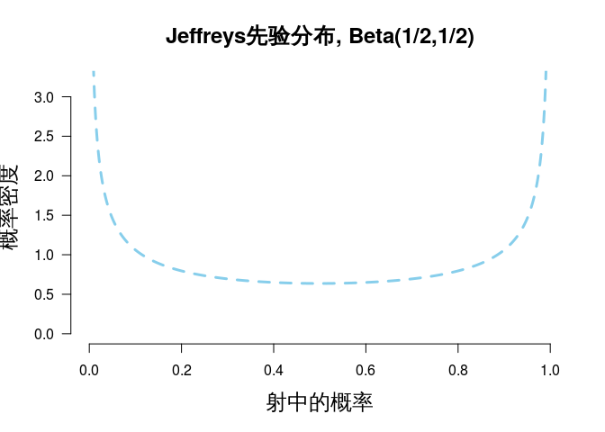

``` r
plot.beta(4,9,ymax=3.2,main="基于已有信息, Beta(4,9)")
```

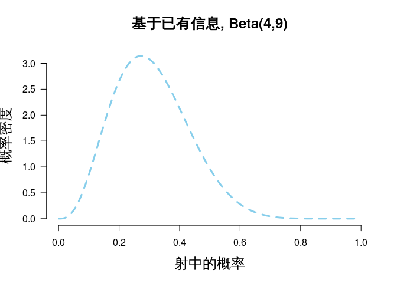

第1轮（13次射中，12次射失）后的情况：

``` r
plot.beta(1,1,13,25,main="Beta(1,1) to Beta(14,13)",ymax=10)
```

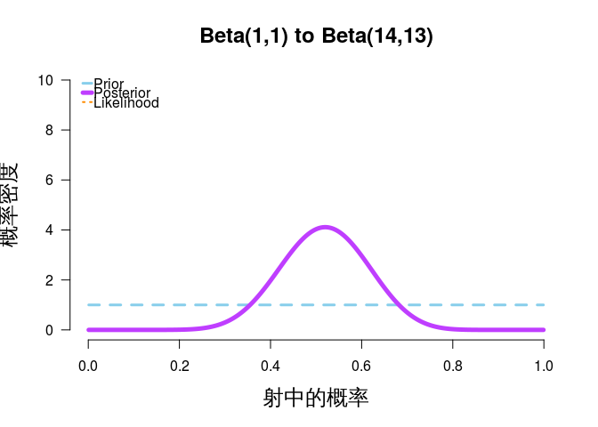

``` r
plot.beta(.5,.5,13,25,main="Beta(1/2,1/2) to Beta(13.5,12.5)",ymax=10)
```

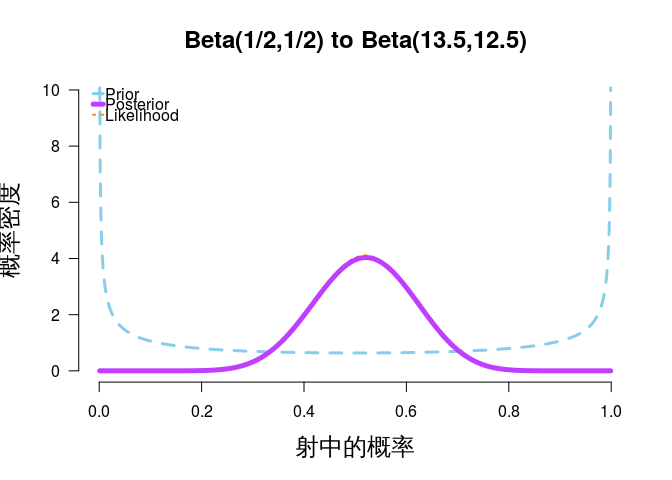

``` r
plot.beta(4,9,13,25,main="Beta(4,9) to Beta(17,21)",ymax=10)
```

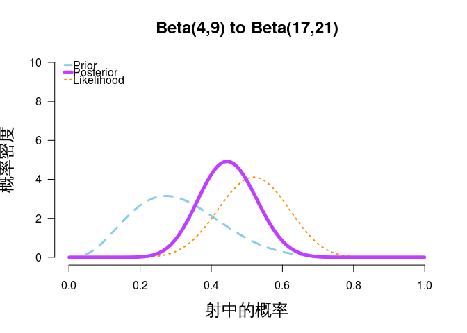

第1轮结果显示当使用信息量很低的均匀分布和Jeffreys分布时，先验概率和后验概率基本相同，只有第3种情况下先验和后验概率出现了明显的区别，且比前二者更悲观（峰值偏左：在0.4左右，前二者峰值在0.5左右），这是由于先验概率对射手的估计偏悲观所致。

三者的概率曲线都很宽，表明对射中率的预测有较大的不确定性。

第2轮（12次射中，13次射失）后的情况：

``` r
plot.beta(14,13,12,25,ymax=10,main="Beta(14,13) to Beta(26,26)")
```

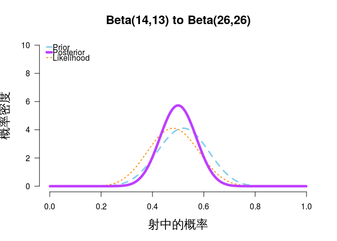

``` r
plot.beta(13.5,12.5,12,25,ymax=10,main="Beta(13.5,12.5) to Beta(25.5,25.5)")
```

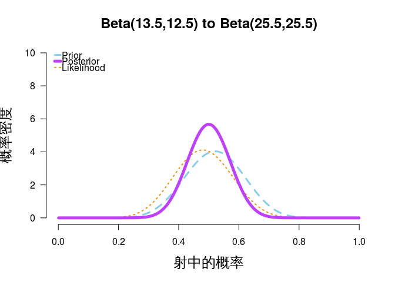

``` r
plot.beta(17,21,12,25,ymax=10,main="Beta(17,21) to Beta(29,34)")
```

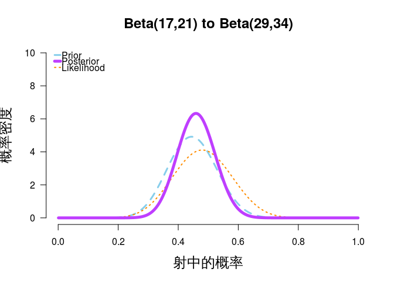

前两条曲线基本一致，第3条曲线虽然仍然偏左，但差距开始缩小。 三条曲线都开始收窄，表示预测的确定性增加了。

第3轮（14次射中，11次射失）后的情况：

``` r
plot.beta(26,26,14,25,ymax=10,main="Beta(26,26) to Beta(40,37)")
```

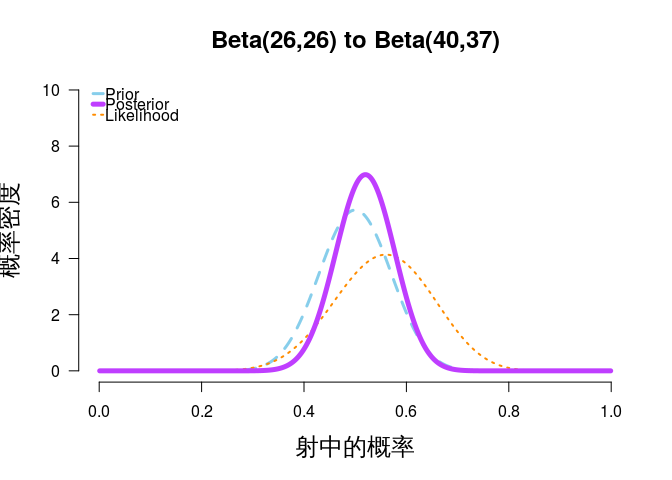

``` r
plot.beta(25.5,25.5,14,25,ymax=10,main="Beta(25.5,25.5) to Beta(39.5,36.5)")
```

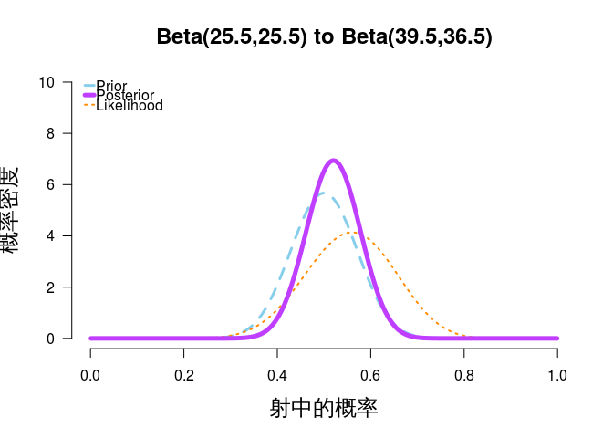

``` r
plot.beta(29,34,14,25,ymax=10,main="Beta(29,34) to Beta(43,45)")
```

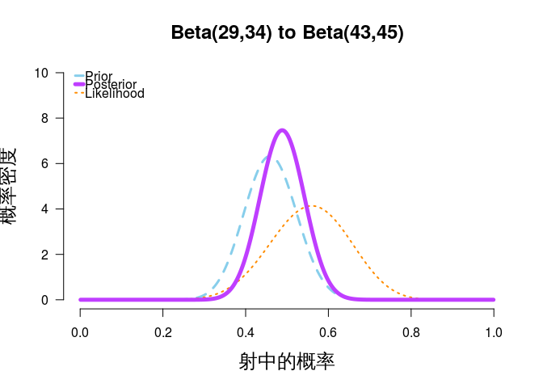

第4轮（19次射中，6次射失）后的情况：

``` r
plot.beta(40,37,19,25,ymax=10,main="Beta(40,37) to Beta(59,43)")
```

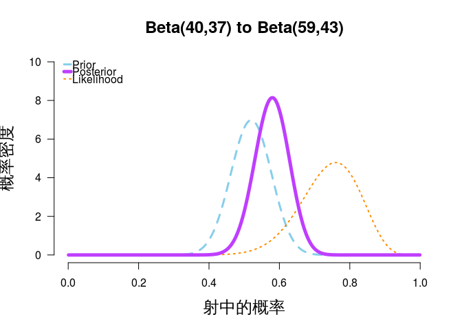

``` r
plot.beta(39.5,36.5,19,25,ymax=10,main="Beta(39.5,36.5) to Beta(58.5,42.5)")
```

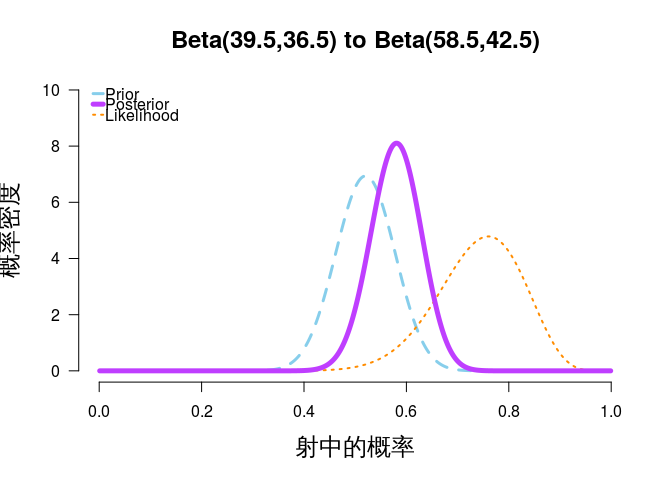

``` r
plot.beta(43,45,19,25,ymax=10,main="Beta(43,45) to Beta(62,51)")
```

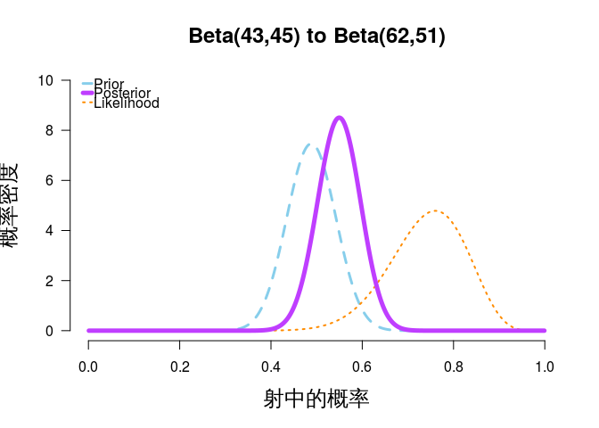

轮次越多，曲线越来越收窄，表示对预测的确定性不断上升。且结论越来越接近。

基于总成绩的前后对比：

``` r
plot.beta(1,1,58,100,ymax=10,main="Beta(1,1) to Beta(59,43)")
```

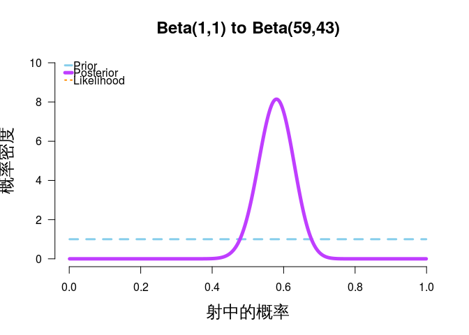

``` r
plot.beta(.5,.5,58,100,ymax=10,main="Beta(1/2,1/2) to Beta(58.5,42.5)")
```

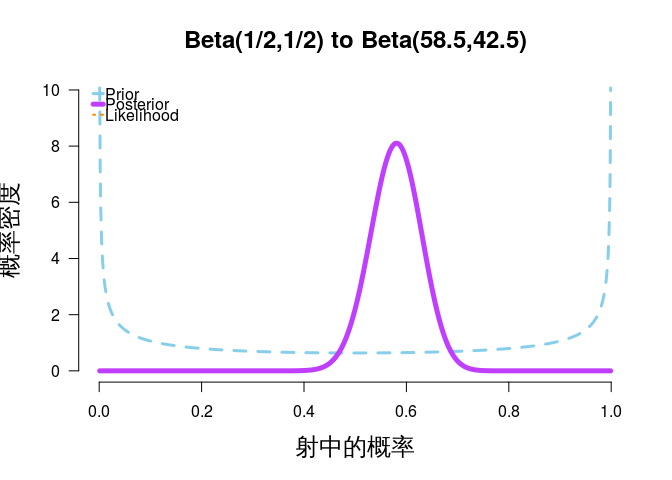

``` r
plot.beta(4,9,58,100,ymax=10,main="Beta(4,9) to Beta(62,51)")
```

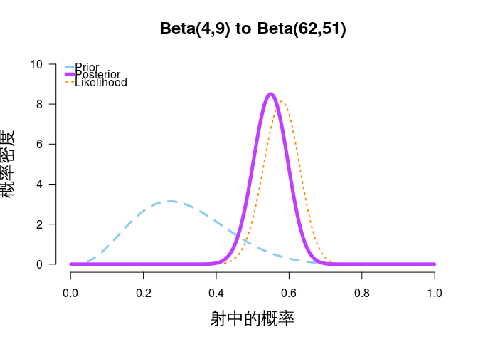

可以看到不论分阶段，还是一次性考虑总成绩，最终结果是一致的。

参考文献
========

-   [Understanding Bayes: A Look at the Likelihood](https://alexanderetz.com/2015/04/15/understanding-bayes-a-look-at-the-likelihood/)

-   [Understanding Bayes: Updating priors via the likelihood](https://alexanderetz.com/2015/07/25/understanding-bayes-updating-priors-via-the-likelihood/)

-   [参数估计：贝叶斯思想和贝叶斯参数估计](https://blog.csdn.net/pipisorry/article/details/51471222)

-   [极大似然估计与贝叶斯估计](https://blog.csdn.net/liu1194397014/article/details/52766760)

-   [What is the difference in Bayesian estimate and maximum likelihood estimate?](https://stats.stackexchange.com/questions/74082/what-is-the-difference-in-bayesian-estimate-and-maximum-likelihood-estimate)

-   [Help me understand Bayesian prior and posterior distributions](https://stats.stackexchange.com/questions/58564/help-me-understand-bayesian-prior-and-posterior-distributions/58792#58792)

-   [Comparing maximum likelihood estimation (MLE) and Bayes' Theorem](https://stats.stackexchange.com/questions/73439/comparing-maximum-likelihood-estimation-mle-and-bayes-theorem/73470#73470)

-   [Is the invariance property of the ML estimator nonsensical from a Bayesian perspective?](https://stats.stackexchange.com/questions/313617/is-the-invariance-property-of-the-ml-estimator-nonsensical-from-a-bayesian-persp/337240#337240)

-   [Bayesian Estimation](https://rstudio-pubs-static.s3.amazonaws.com/91970_901d926809c14096b5146e67f21c764d.html)

-   [R Scripts for Bayesian Computation with R, Second Edition](http://personal.bgsu.edu/~albert/R.Scripts/index.html)

-   [Conjugate prior](https://en.wikipedia.org/wiki/Conjugate_prior#Discrete_distributions)
