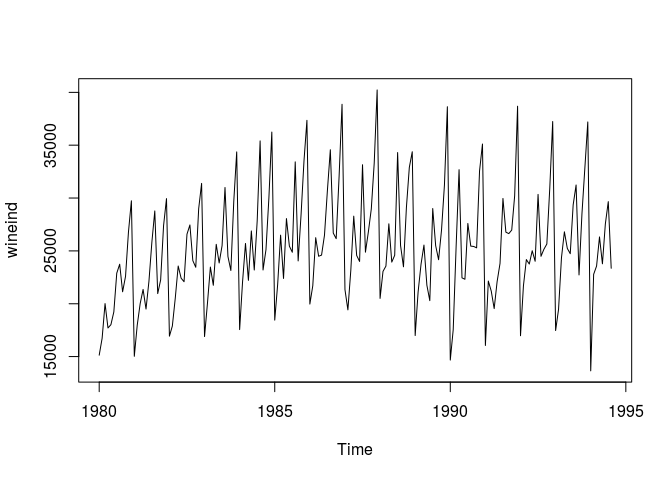
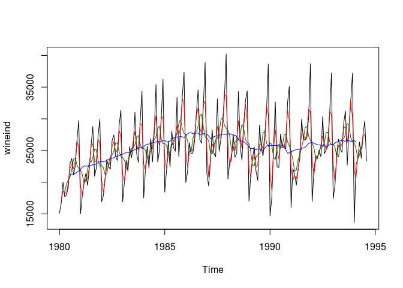
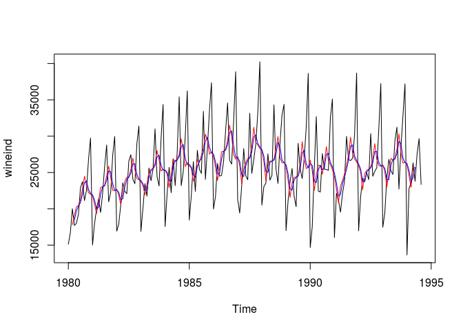

基于移动平均的数据平滑算法
================

-   [实现方法](#实现方法)
-   [参数分析](#参数分析)
    -   [order](#order)
    -   [center](#center)
-   [算法总结](#算法总结)

实现方法
========

移动平均（moving average, MA）使用当前数据点以及单侧或者双侧的相邻数据点的（加权）平均值作为对当前数据点的修正，剔除序列中的高频成分，实现数据平滑的效果。参与平均的数据点越多，平滑效果越好。

时间序列  在  时间点上双侧 MA 计算公式是：

 = \frac{y(t-k) + y(t-k+1) + \dots + y(t) + \dots + y(t+k-1) + y(t+k)}{m}
")

这里  是阶数（*order*），也就是参与平均的数据点个数；/2")。

参数分析
========

以1980年到1994年澳大利亚瓶装酒销售量为例说明利用MA方法去除季节和随即波动，估计长期趋势的方法。 本例中**输入数据**的数量值和时序图如下：

``` r
library(forecast)
wineind
```

    ##        Jan   Feb   Mar   Apr   May   Jun   Jul   Aug   Sep   Oct   Nov
    ## 1980 15136 16733 20016 17708 18019 19227 22893 23739 21133 22591 26786
    ## 1981 15028 17977 20008 21354 19498 22125 25817 28779 20960 22254 27392
    ## 1982 16933 17892 20533 23569 22417 22084 26580 27454 24081 23451 28991
    ## 1983 16896 20045 23471 21747 25621 23859 25500 30998 24475 23145 29701
    ## 1984 17556 22077 25702 22214 26886 23191 27831 35406 23195 25110 30009
    ## 1985 18450 21845 26488 22394 28057 25451 24872 33424 24052 28449 33533
    ## 1986 19969 21701 26249 24493 24603 26485 30723 34569 26689 26157 32064
    ## 1987 21337 19419 23166 28286 24570 24001 33151 24878 26804 28967 33311
    ## 1988 20504 23060 23562 27562 23940 24584 34303 25517 23494 29095 32903
    ## 1989 16991 21109 23740 25552 21752 20294 29009 25500 24166 26960 31222
    ## 1990 14672 17543 25453 32683 22449 22316 27595 25451 25421 25288 32568
    ## 1991 16052 22146 21198 19543 22084 23816 29961 26773 26635 26972 30207
    ## 1992 16974 21697 24179 23757 25013 24019 30345 24488 25156 25650 30923
    ## 1993 17466 19463 24352 26805 25236 24735 29356 31234 22724 28496 32857
    ## 1994 13652 22784 23565 26323 23779 27549 29660 23356                  
    ##        Dec
    ## 1980 29740
    ## 1981 29945
    ## 1982 31386
    ## 1983 34365
    ## 1984 36242
    ## 1985 37351
    ## 1986 38870
    ## 1987 40226
    ## 1988 34379
    ## 1989 38641
    ## 1990 35110
    ## 1991 38687
    ## 1992 37240
    ## 1993 37198
    ## 1994

``` r
plot(wineind)
```



order
-----

*order* 越大，越能包含更多的全局信息，平滑效果越好。 下面是瓶装酒销售量以2个月、6个月和1年为阶数的计算结果对比：

``` r
plot(wineind)
mas2 <- ma(wineind, order = 2)
mas6 <- ma(wineind, order = 6)
mas12 <- ma(wineind, order = 12)
lines(mas2, col = 'red')
lines(mas6, col = 'darkgreen')
lines(mas12, col = 'blue')
```



可以看到算法的**输出**也是一个时间序列，但长度小于输入时间序列，阶数越高，输出序列长度越短。

实际使用过程中，根据平滑目标为阶数选择合理值，例如上面的例子中，如果希望分析年度波动，阶数不应大于12，如果分析目标是季度波动，则阶数不应大于4。

center
------

当阶数为偶数时，未来数据点个数比过去数据点个数多一个。例如当  时，当前数据点的值是未来4个相邻点与自身以及过去3个数据点的平均值。

当 *center* 被设置为 *TRUE*，且  是偶数时，/2") 被分为两种情况：向上取整和向下取整， 基于这两个值分别计算出 ") 的值，再取平均，得到最终结果。

下面对比了不同的 *center* 设置下计算结果的差异：

``` r
plot(wineind)
mas8 <- ma(wineind, order = 6, centre = FALSE)
mas8c <- ma(wineind, order = 6, centre = TRUE)
lines(mas8, col = 'red')
lines(mas8c, col = 'blue')
```



可以看到 `centre = TRUE` 时平均效果略好于 `centre = FALSE` 的结果，随着阶数的升高，差距会越来越小。

算法总结
========

移动平均是一种简单高效的数据平滑方法，计算量小，适用范围广。实际使用过程中，如果根据业务目标不能确定准确的阶数，可以结合方差分析或者CV技术确定最佳值。
