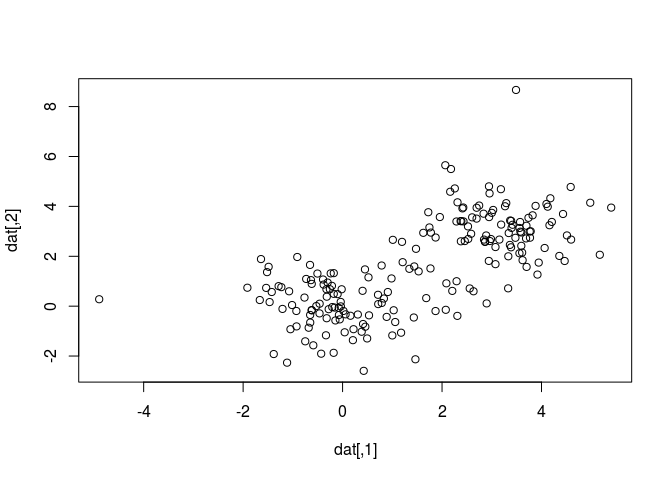
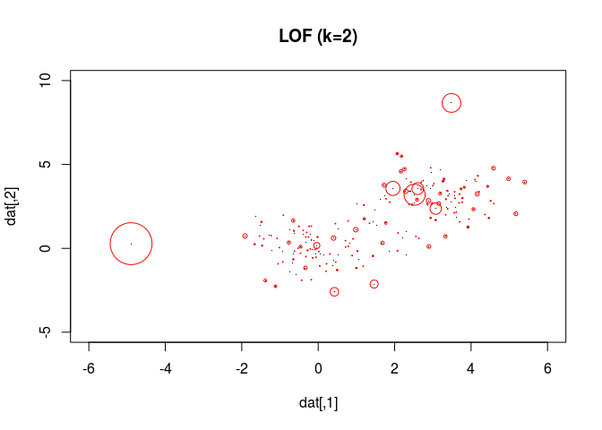
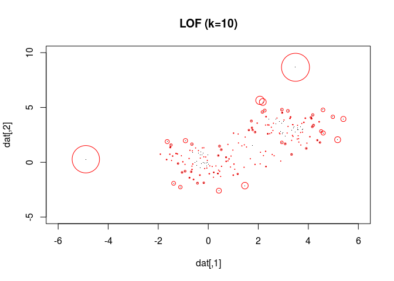
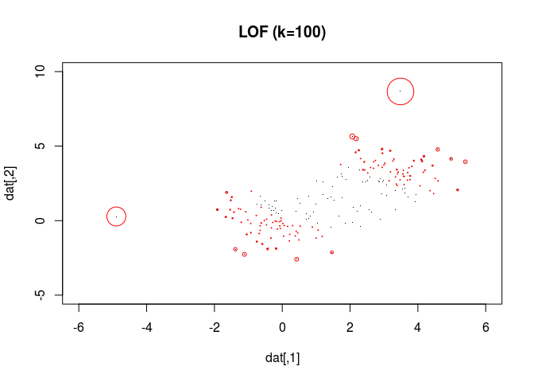
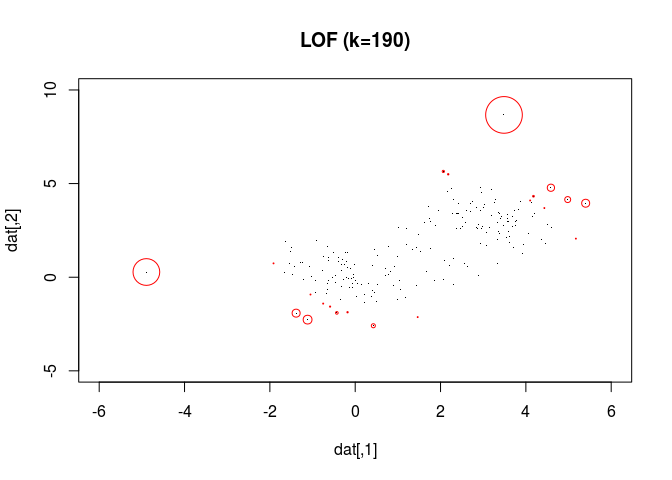

基于聚类的异常值检测方法
================

-   [功能和使用场景](#功能和使用场景)
-   [参数分析](#参数分析)
-   [实例分析](#实例分析)
-   [参考文献](#参考文献)

功能和使用场景
==============

基于聚类的异常值检测对数据分布特征没有要求，不需要对数据进行预处理，计算成本低。

在基于聚类（密度方法）的异常值检测方法中，LOF (Local Outlier Factor) 是常用的一种。 它比较每个数据点和临近点的局部数据密度，如果这个点的数据密度显著低于临近点的局部数据密度，说明这是一个异常点。

具体计算过程是：

1.  输入临近点的数量 ；

2.  对数据点，找到它的  个临近点；

3.  分别计算临近点和  点的局部密度，得到二者的比值 

4.  当  接近1时，表示这是“正常”数据点，当  远高于1时，表明这是一个异常点，值越大，异常程度越高。

LOF方法的 **输入** 是一个包含输入数据的Dataframe，**参数** 是 ，**输出** 是每个数据点及其 LOF 值组成的 Dataframe.

参数分析
========

LOF方法唯一的参数是临近点数量 。  值越大，参考的临近点越多，数据点的密度分布越平均，检测错误率越低，但计算成本随之升高。

当对检测结果正确率有较高的要求，且计算资源允许时，可以取较高的  值（不超过数据点总数）； 当对检测结果正确率要求不高，且不希望消耗较多的计算资源时，可以取较小的  值（一般不小于10）。

具体对比结果见”实例分析“一节。

实例分析
========

下面的测试数据集包含200个数据点，每个数据点包含两个特征，其中前100个数据点以 (3, 3) 为中心正态分布，后100个数据点以 (0, 0) 为中心正态分布。在其中随机选取2个数据点，通过分别向左、向上移动5个单位变为异常数据点，见下面的原始数据分布图。

生成 **输入** 数据（`dat`）并绘图：

``` r
library(dbscan)
set.seed(1)
pts.no <- 200
dis <- 3
dat <- matrix(rnorm(pts.no * 2), ncol = 2)
dat[1 : pts.no / 2, ] = dat[1 : pts.no / 2, ] + dis  # 前一半数据点向右上平移3个单位
abn <- sample(pts.no, 2)
dat[abn[1], 1] <- dat[abn[1], 1] - 5
dat[abn[2], 2] <- dat[abn[2], 2] + 5
head(dat)   # Dataframe 前6行
```

    ##          [,1]      [,2]
    ## [1,] 2.373546 3.4094018
    ## [2,] 3.183643 4.6888733
    ## [3,] 2.164371 4.5865884
    ## [4,] 4.595281 2.6690922
    ## [5,] 3.329508 0.7147645
    ## [6,] 2.179532 5.4976616

``` r
plot(dat)
```



图中左侧和右上角的两个数据点就是”人造“异常数据点。

分别取  等于1, 2, 10, 100, 190时，计算每个数据点的LOF值，并绘制LOF曲线：

``` r
lof2 <- lof(dat, k = 2)
lof10 <- lof(dat, k = 10)
lof100 <- lof(dat, k = 100)
lof190 <- lof(dat, k = 190)
```

以下图示中数据点的异常度与其圆圈的半径成正比，圆半径越大，异常程度越高。

 时的异常检测结果：

``` r
plot(dat, pch = ".", xlim = c(-6, 6), ylim = c(-5, 10), main = "LOF (k=2)")
points(dat, cex = lof2 - 1, pch = 1, col="red")
```



检测到了两个异常点，但(3, 3)为中心的簇中存在一定数量的误报。

 时的异常检测结果：

``` r
plot(dat, pch = ".", xlim = c(-6, 6), ylim = c(-5, 10), main = "LOF (k=10)")
points(dat, cex = (lof10 - 1) * 2, pch = 1, col="red")
```



准确率较  时有所上升。

 时的异常检测结果：

``` r
plot(dat, pch = ".", xlim = c(-6, 6), ylim = c(-5, 10), main = "LOF (k=100)")
points(dat, cex = (lof100 - 1) * 5, pch = 1, col="red")
```



计算结果准确率较高，表明总数据量的 50% 是一个比较好偏向准确率的选择。

 时的异常检测结果：

``` r
plot(dat, pch = ".", xlim = c(-6, 6), ylim = c(-5, 10), main = "LOF (k=190)")
points(dat, cex = (lof190 - 1) * 15, pch = 1, col="red")
```



准确率非常高，相应地计算成本也最高。

以  为例生成 **输出** 结果：

``` r
output <- cbind(dat, lof10)
head(output)
```

    ##                            lof10
    ## [1,] 2.373546 3.4094018 1.004917
    ## [2,] 3.183643 4.6888733 1.337077
    ## [3,] 2.164371 4.5865884 1.315118
    ## [4,] 4.595281 2.6690922 1.493024
    ## [5,] 3.329508 0.7147645 1.223707
    ## [6,] 2.179532 5.4976616 1.812830

参考文献
========

-   [Anomaly detection](https://en.wikipedia.org/wiki/Anomaly_detection)

-   [A Brief Overview of Outlier Detection Techniques](https://towardsdatascience.com/a-brief-overview-of-outlier-detection-techniques-1e0b2c19e561)

-   [5 Anomaly Detection Algorithms in Data Mining](http://intellspot.com/anomaly-detection-algorithms/)

-   [Comparing anomaly detection algorithms for outlier detection on toy datasets](http://scikit-learn.org/dev/auto_examples/plot_anomaly_comparison.html)

-   [Compare outlier detection methods with the OutliersO3 package](http://blog.revolutionanalytics.com/2018/03/outliers.html)
