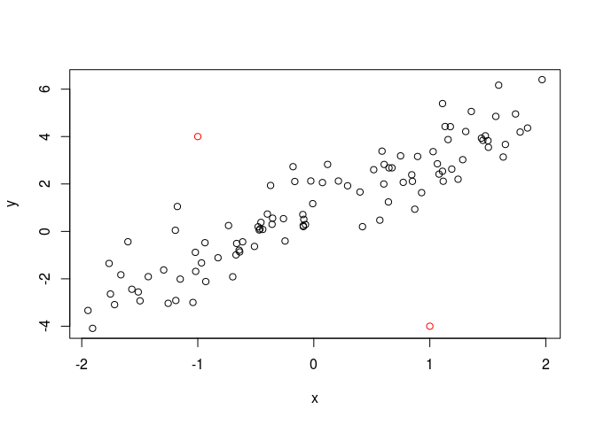

基于拟合的异常值检测方法
================

-   [功能和使用场景](#功能和使用场景)
-   [参数分析](#参数分析)
-   [实例分析](#实例分析)
    -   [Python 实现](#python-实现)
-   [二次型异常检测](#二次型异常检测)
    -   [Python 实现](#python-实现-1)

功能和使用场景
==============

在数据拟合场景下，所谓异常点，指的是那些大幅增加系统中的噪声，同时包含信息极少的数据点， 从定量的角度说，就是那些显著增加模型残差，却对拟合函数影响很小的点。

单纯分析数据点的残差，会受到特征值量纲的影响，所以实践中一般采用 [studentized residual](https://en.wikipedia.org/wiki/Studentized_residual) 作为检测指标， 也就是残差与标准差估计值的商，当它的绝对值大于某个阈值时，认为是异常值。 阈值一般取3，因为正态分布中，![\[\\mu - 3\\sigma, \\mu + 3\\sigma\]](https://latex.codecogs.com/png.latex?%5B%5Cmu%20-%203%5Csigma%2C%20%5Cmu%20%2B%203%5Csigma%5D "[\mu - 3\sigma, \mu + 3\sigma]") 对应 99.7% 的置信区间（参考 [68–95–99.7 rule](https://en.wikipedia.org/wiki/68%E2%80%9395%E2%80%9399.7_rule)）。

参数分析
========

基于拟合的异常点检测包括拟合模型和阈值两个参数。 模型一般是有参数模型，例如线性模型，不同阶次的多项式模型等，阈值一般取3。

算子的 **输入** 是一组包括特征量和响应量的 dataframe（与基于聚类的异常检测方法不同，基于聚类的异常检测不需要响应值）。 算子的 **输出** 是一个向量，其元素是异常数据点在输入 dataframe 中的 ID。

实例分析
========

下面以线性拟合为例，说明基于拟合检测异常点的方法。 首先按线性关系生成正常数据，在  增加一个随机噪声形成最终响应数据：

``` r
set.seed(1)
x <- runif(100, -2, 2)
y <- 1 + 2 * x + rnorm(100)
plot(x, y)
```


在正常数据后追加两个异常点：

``` r
xa <- c(x, -1, 1)
ya <- c(y, 4, -4)
plot(x, y)
points(xa[101], ya[101], col = 'red')
points(xa[102], ya[102], col = 'red')
```



这样包含异常值的特征量 `xa` 和响应量 `ya` 组成了算子的 **输入**。

算子的 **参数** 包括：

-   拟合模型：线性模型；

-   异常值阈值：3。

构造线性拟合模型，对比实际值（数据点）和预测值（蓝色线）：

``` r
mdl <- lm(ya ~ xa)
summary(mdl)  # 输出拟合系数
```

    ## 
    ## Call:
    ## lm(formula = ya ~ xa)
    ## 
    ## Residuals:
    ##     Min      1Q  Median      3Q     Max 
    ## -6.9389 -0.5835 -0.0787  0.6027  5.0090 
    ## 
    ## Coefficients:
    ##             Estimate Std. Error t value Pr(>|t|)    
    ## (Intercept)   0.9650     0.1260   7.657 1.23e-11 ***
    ## xa            1.9740     0.1182  16.699  < 2e-16 ***
    ## ---
    ## Signif. codes:  0 '***' 0.001 '**' 0.01 '*' 0.05 '.' 0.1 ' ' 1
    ## 
    ## Residual standard error: 1.27 on 100 degrees of freedom
    ## Multiple R-squared:  0.736,  Adjusted R-squared:  0.7334 
    ## F-statistic: 278.8 on 1 and 100 DF,  p-value: < 2.2e-16

``` r
y.pred <- predict(mdl)
plot(xa, ya)
lines(xa, y.pred, type = 'l', col = 'blue')
```


可以看到拟合系数 （实际值 ），（实际值 ），都有比较好的精度。

使用 [studentized residual](https://en.wikipedia.org/wiki/Studentized_residual) 分析异常点：

``` r
rst <- rstudent(mdl)
rst[abs(rst) > 3]
```

    ##       101       102 
    ##  4.321189 -6.572252

``` r
plot(y.pred, rst)
points(y.pred[101], rst[101], col = 'red', cex = 2, pch = 3)
points(y.pred[102], rst[102], col = 'red', cex = 2, pch = 3)
```


可知studentized residual绝对值大于3的观测点包括第101, 102两个点，与实际情况吻合。

算子的 **输出** 就是包含异常值ID：101, 102的向量。

异常点对模型的影响，可以通过对比去除异常点后的新模型与原有模型得到。 下面是去掉异常点后拟合的模型，及对应的模型系数和残差：

``` r
mdl2 <- lm(y ~ x)
summary(mdl2)
```

    ## 
    ## Call:
    ## lm(formula = y ~ x)
    ## 
    ## Residuals:
    ##      Min       1Q   Median       3Q      Max 
    ## -1.84978 -0.56222 -0.08707  0.52427  2.51661 
    ## 
    ## Coefficients:
    ##             Estimate Std. Error t value Pr(>|t|)    
    ## (Intercept)  0.97685    0.09432   10.36   <2e-16 ***
    ## x            2.07809    0.08836   23.52   <2e-16 ***
    ## ---
    ## Signif. codes:  0 '***' 0.001 '**' 0.01 '*' 0.05 '.' 0.1 ' ' 1
    ## 
    ## Residual standard error: 0.9411 on 98 degrees of freedom
    ## Multiple R-squared:  0.8495, Adjusted R-squared:  0.8479 
    ## F-statistic: 553.1 on 1 and 98 DF,  p-value: < 2.2e-16

可以看到去掉异常点后，残差最大值从5.01下降到了2.52，而模型系数变化很小（0.96 vs 0.98，1.97 vs 2.07）， 符合前面对异常点的定义。

Python 实现
-----------

下面基于线性拟合模型分析 Boston 数据集的异常点：

``` python
import numpy as np
from sklearn.datasets import load_boston
import pandas as pd
import statsmodels.api as sm
```

    ## /home/leo/apps/miniconda3/envs/anaconda/lib/python3.6/site-packages/statsmodels/compat/pandas.py:56: FutureWarning: The pandas.core.datetools module is deprecated and will be removed in a future version. Please use the pandas.tseries module instead.
    ##   from pandas.core import datetools

``` python
from statsmodels.stats.outliers_influence import OLSInfluence
raw = load_boston()
vlower = np.vectorize(lambda x: x.lower())
df = pd.DataFrame(data=raw.data, columns=vlower(raw.feature_names))
df['medv'] = raw.target
lm = sm.OLS.from_formula('medv ~ lstat', df)
res = lm.fit()
# print(res.summary())
rst = OLSInfluence(res).summary_frame().student_resid
print(f'There are {sum(abs(rst) > 3)} outliers in Boston dataset.')
```

    ## There are 11 outliers in Boston dataset.

二次型异常检测
==============

试验数据包含两个特征和一个响应值：

``` r
set.seed(1)
x1 <- runif(100, 2, 5)
x2 <- runif(100, 12, 28)
yraw <- 21.22 + 5.22 * x1 * x2 + 3.44 * x1 * x1 + 9.28 * x2 * x2
y <- jitter(yraw, factor = 3)
```

按二次型形式拟合模型：

``` r
mdl <- lm(y ~ I(x1 ^ 2) + I(x2 ^ 2) + I(x1 * x2))
summary(mdl)
```

    ## 
    ## Call:
    ## lm(formula = y ~ I(x1^2) + I(x2^2) + I(x1 * x2))
    ## 
    ## Residuals:
    ##      Min       1Q   Median       3Q      Max 
    ## -0.54307 -0.24689 -0.08544  0.27594  0.70628 
    ## 
    ## Coefficients:
    ##              Estimate Std. Error t value Pr(>|t|)    
    ## (Intercept) 2.096e+01  1.207e-01   173.7   <2e-16 ***
    ## I(x1^2)     3.494e+00  2.524e-02   138.4   <2e-16 ***
    ## I(x2^2)     9.281e+00  8.211e-04 11303.6   <2e-16 ***
    ## I(x1 * x2)  5.204e+00  8.732e-03   595.9   <2e-16 ***
    ## ---
    ## Signif. codes:  0 '***' 0.001 '**' 0.01 '*' 0.05 '.' 0.1 ' ' 1
    ## 
    ## Residual standard error: 0.3302 on 96 degrees of freedom
    ## Multiple R-squared:      1,  Adjusted R-squared:      1 
    ## F-statistic: 9.118e+08 on 3 and 96 DF,  p-value: < 2.2e-16

可以看到拟合参数与理论值基本吻合。

计算预测值的 studentized residuals，这里将异常值阈值设为3：

``` r
library(MASS)
sr <- studres(mdl)
sum(abs(sr) > 3)
```

    ## [1] 0

计算结果显示没有异常值，与数据实际情况吻合。

Python 实现
-----------

基于 statsmodels 包实现二次型拟合：

``` python
import numpy as np
from sklearn.datasets import load_boston
import pandas as pd
import statsmodels.api as sm
from statsmodels.stats.outliers_influence import OLSInfluence
raw = load_boston()
vlower = np.vectorize(lambda x: x.lower())
df = pd.DataFrame(data=raw.data, columns=vlower(raw.feature_names))
df['medv'] = raw.target
lm = sm.OLS.from_formula('medv ~ lstat + I(dis**2) + I(dis*rm)', df)
res = lm.fit()
# print(res.summary())
rst = OLSInfluence(res).summary_frame().student_resid
print(f'There are {sum(abs(rst) > 3)} outliers in Boston dataset.')
```

    ## There are 10 outliers in Boston dataset.

基于 sklearn 的实现方法：

``` python
from sklearn.preprocessing import PolynomialFeatures
from sklearn.linear_model import LinearRegression
from sklearn.pipeline import Pipeline
from statsmodels.stats.outliers_influence import OLSInfluence
import numpy as np
pl = Pipeline([('poly', PolynomialFeatures(degree=3)),
                  ('linear', LinearRegression(fit_intercept=False))])
x = np.arange(5)
y = 3 - 2 * x + x ** 2 - x ** 3
model = pl.fit(x[:, np.newaxis], y)
print(model.named_steps['linear'].coef_)
# rst = OLSInfluence(model).summary_frame().student_resid
# print(f'There are {sum(abs(rst) > 3)} outliers in Boston dataset.')
```

    ## [ 3. -2.  1. -1.]

由于 `OLSInfluence()` 不接受 `Pipeline` 对象，所以基于 sklearn 只能算系数，不能计算 studentized residuals.
