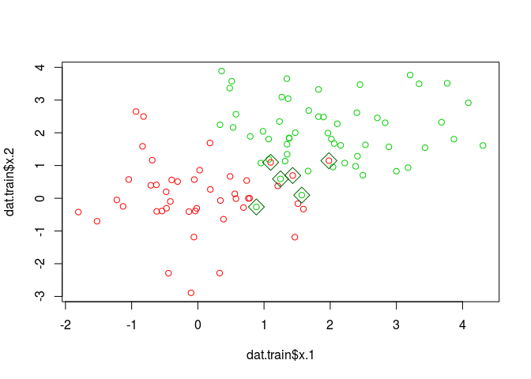
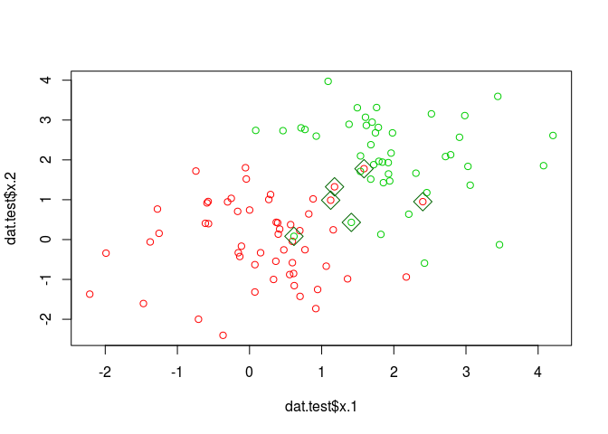
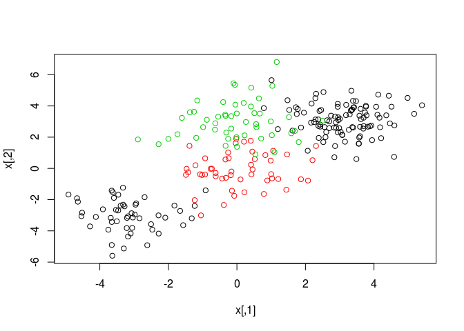
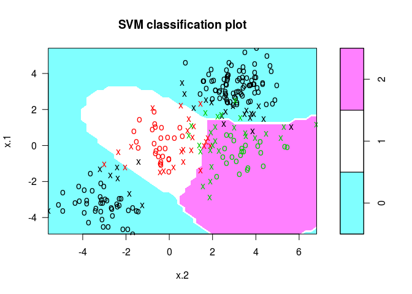
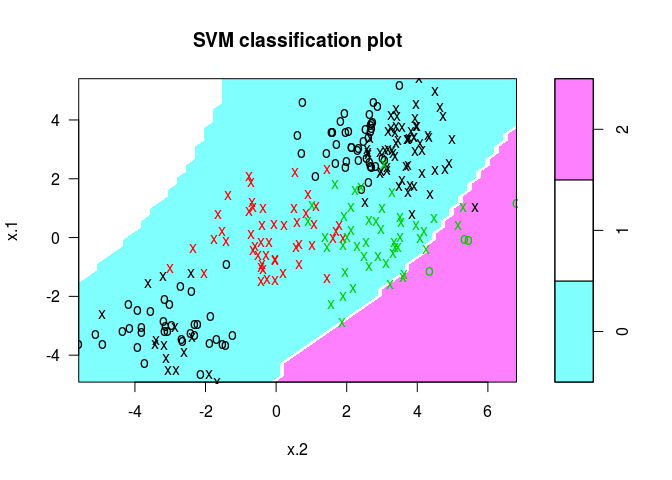

支持向量机算子介绍
================

-   [功能和使用场景](#功能和使用场景)
    -   [使用场景](#使用场景)
    -   [关键参数](#关键参数)
-   [参数分析](#参数分析)
    -   [cost 分析](#cost-分析)
    -   [kernel 和 degree 分析](#kernel-和-degree-分析)
-   [算法总结](#算法总结)

功能和使用场景
==============

使用场景
--------

支持向量机（SVM）主要用于求解有监督的分类问题。 经典SVM算法用于求解二分类问题，扩展后可以求解多分类问题。

SVM的基本原理是在训练集所在的超空间中找到一个能够划分训练数据的最大间隙的超平面，根据核函数的不同，超平面可以是线性的或者非线性的，可以允许一定程度的训练错误率，以降低过拟合风险。

优点：适应各种数据特征，精度高、预测速度快；

缺点：需要的训练数据量相对较大，黑盒预测（特征空间变换后，各个维度没有明确的业务含义）。

适用场景：数据区分度好，样本量大，精度要求高，不需要高解释能力。

关键参数
--------

按照重要程度，SVM的主要参数包括：

-   核函数：主要有线性、多项式和径向函数3种；

-   cost：超平面的容错性指标，cost越高，容错性越低，margin越窄，bias越低，variance越高；

-   degree：多项式核中多项式的次数，次数越高边界越“柔软”；

-   gamma：径向核参数，gamma越大，bias越高，variance越低。

参数分析
========

cost 分析
---------

训练集包含20个观测点，其中一半符合期望为 (0, 0),方差为1的正态分布，另一半符合期望为 (2, 2),方差为1的正态分布：

``` r
library(e1071)
set.seed(1)
dat.size <- 200
x <- matrix(rnorm(dat.size * 2), ncol = 2)
y <- c(rep(0, dat.size / 2), rep(1, dat.size / 2))
x[y == 1, ] <- x[y == 1, ] + 2
dat <- data.frame(x = x, y = as.factor(y))
train <- sample(dat.size, dat.size / 2)
dat.train <- dat[train, ]
dat.test <- dat[-train, ]
plot(dat.train$x.1, dat.train$x.2, col = as.integer(dat.train$y) + 1)
```


在训练集上拟合SVM，使用线性核，cost取0.1：

``` r
small.cost <- svm(y ~ ., data = dat.train, kernel = 'linear', cost = 0.1, scale = FALSE)
plot(small.cost, dat.train)
```


支持向量分布：

``` r
summary(small.cost)
```

    ## 
    ## Call:
    ## svm(formula = y ~ ., data = dat.train, kernel = "linear", cost = 0.1, 
    ##     scale = FALSE)
    ## 
    ## 
    ## Parameters:
    ##    SVM-Type:  C-classification 
    ##  SVM-Kernel:  linear 
    ##        cost:  0.1 
    ##       gamma:  0.5 
    ## 
    ## Number of Support Vectors:  32
    ## 
    ##  ( 16 16 )
    ## 
    ## 
    ## Number of Classes:  2 
    ## 
    ## Levels: 
    ##  0 1

训练集容错情况：

``` r
table(fitted = small.cost$fitted, truth = dat.train$y)
```

    ##       truth
    ## fitted  0  1
    ##      0 42  3
    ##      1  3 52

``` r
err.points <- dat.train[small.cost$fitted != dat.train$y, ]
plot(dat.train$x.1, dat.train$x.2, col = as.integer(dat.train$y) + 1)
points(err.points$x.1, err.points$x.2, pch = 5, col = 'darkgreen', cex = 2)
```


泛化错误率：

``` r
small.cost.pred <- predict(small.cost, newdata = dat.test)
table(predict = small.cost.pred, truth = dat.test$y)
```

    ##        truth
    ## predict  0  1
    ##       0 51  3
    ##       1  4 42

``` r
err.points <- dat.test[small.cost.pred != dat.test$y, ]
plot(dat.test$x.1, dat.test$x.2, col = as.integer(dat.test$y) + 1)
points(err.points$x.1, err.points$x.2, pch = 5, col = 'darkgreen', cex = 2)
```


*cost* 改为100：

``` r
big.cost <- svm(y ~ ., data = dat.train, kernel = 'linear', cost = 100, scale = FALSE)
plot(big.cost, dat.train)
```


支持向量分布：

``` r
summary(big.cost)
```

    ## 
    ## Call:
    ## svm(formula = y ~ ., data = dat.train, kernel = "linear", cost = 100, 
    ##     scale = FALSE)
    ## 
    ## 
    ## Parameters:
    ##    SVM-Type:  C-classification 
    ##  SVM-Kernel:  linear 
    ##        cost:  100 
    ##       gamma:  0.5 
    ## 
    ## Number of Support Vectors:  16
    ## 
    ##  ( 8 8 )
    ## 
    ## 
    ## Number of Classes:  2 
    ## 
    ## Levels: 
    ##  0 1

支持向量数量明显降低，模型 variance 升高。

训练集容错情况：

``` r
table(fitted = big.cost$fitted, truth = dat.train$y)
```

    ##       truth
    ## fitted  0  1
    ##      0 42  3
    ##      1  3 52

``` r
err.points <- dat.train[big.cost$fitted != dat.train$y, ]
plot(dat.train$x.1, dat.train$x.2, col = as.integer(dat.train$y) + 1)
points(err.points$x.1, err.points$x.2, pch = 5, col = 'darkgreen', cex = 2)
```



训练集上的错误率降低了。

泛化错误率：

``` r
big.cost.pred <- predict(big.cost, newdata = dat.test)
table(predict = big.cost.pred, truth = dat.test$y)
```

    ##        truth
    ## predict  0  1
    ##       0 51  2
    ##       1  4 43

``` r
err.points <- dat.test[big.cost.pred != dat.test$y, ]
plot(dat.test$x.1, dat.test$x.2, col = as.integer(dat.test$y) + 1)
points(err.points$x.1, err.points$x.2, pch = 5, col = 'darkgreen', cex = 2)
```



可以看到随着cost越高，容错性逐渐越低，margin变窄，bias变低，所以需要避免过拟合风险、提高模型稳定性时，采用较小的cost，否则使用较大的cost。

实际建模过程中，最优的 *cost* 多通过 cross-validation 确定。

kernel 和 degree 分析
---------------------

``` r
set.seed(1)
dis <- 3
x <- matrix(rnorm(250 * 2), ncol = 2)
x[1:100, ] <- x[1:100, ] + dis
x[101:150, ] <- x[101:150, ] - dis
x[201:250, 2] <- x[201:250, 2] + dis
y <- c(rep(0, 150), rep(1, 50), rep(2, 50))
dat <- data.frame(x = x, y = as.factor(y))
plot(x, col = y + 1)
```



使用 one-vs-one 模式拟合 径向核SVM：

``` r
svmfit <- svm(y ~ ., data = dat, kernel = 'radial')
plot(svmfit, dat)
```

 使用线性核：

``` r
svmfit <- svm(y ~ ., data = dat, kernel = 'linear')
plot(svmfit, dat)
```


使用二次多项式核：

``` r
svmfit <- svm(y ~ ., data = dat, kernel = 'polynomial', degree = 2)
plot(svmfit, dat)
```


使用高次多项式核：

``` r
svmfit <- svm(y ~ ., data = dat, kernel = 'polynomial', degree = 5)
plot(svmfit, dat)
```



可以看到，当选择的 kernel 不适合具体业务场景时，不论如何提高 kernel 的拟合能力，泛化错误率都难以降低，且会带来严重的过拟合，所以具体建模过程中，首先要根据业务场景对分类边界的类型（环状/曲线/直线）和复杂程度做大致的估计，再决定使用哪种类型的 kernel，如果使用多项式 kernel，边界越复杂，degree 越高，但过高会导致过拟合，可以结合 cross-validation, best tune 等技术确定最佳值。

算法总结
========

SVM算法是监督学习中分类场景最常用之一，它能适应各种数据特征，具有精度高、预测速度快的优点，但需要的训练数据量相对较大，且属于黑盒预测。适用于数据区分度好，样本量大，精度要求高，不需要高解释能力的业务场景。
